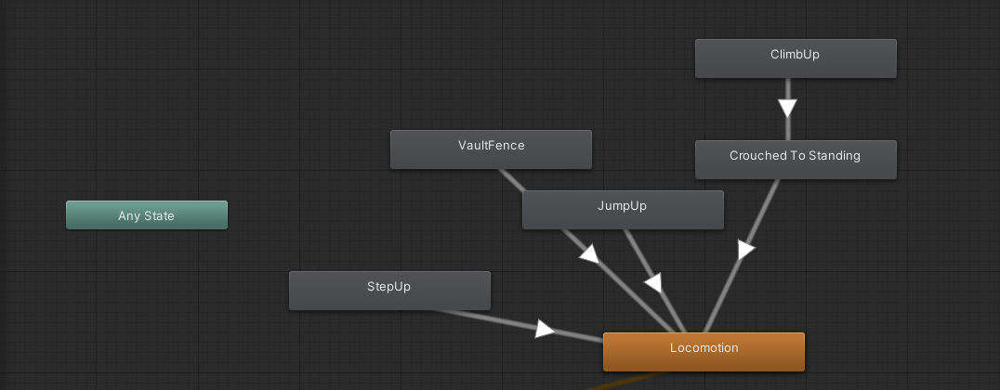
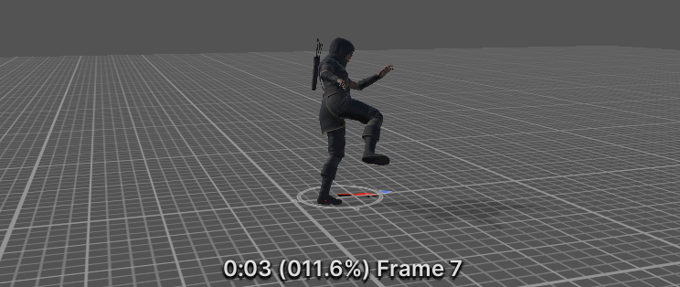
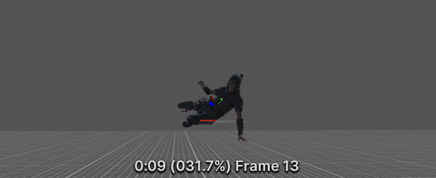
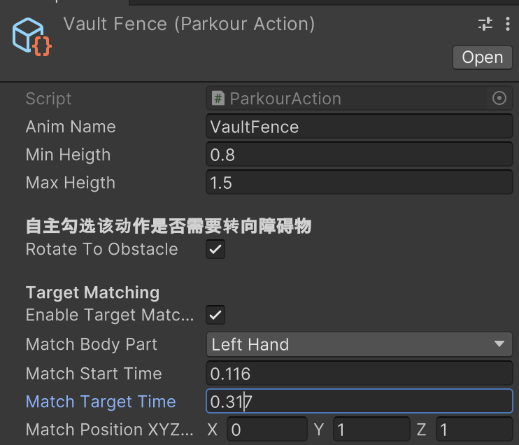
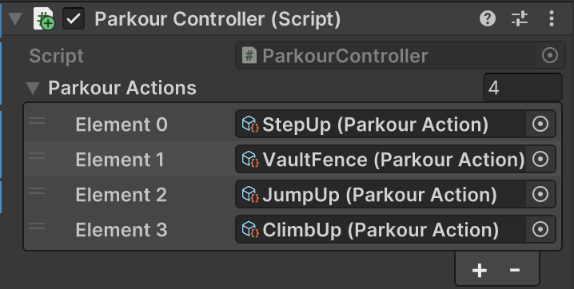

# Parkour Climbing System

——类刺客信条跑酷系统

**摘要：这个项目不会用到除模型动画之外的任何资产，完全从0开始构建**

## Day1 摄像头脚本

在unity中，xyz轴是右手坐标系，即x水平向右，y垂直向上，z水平向前

```csharp
public class CameraController : MonoBehaviour
{
    //摄像机跟随的目标
    [SerializeField] Transform followTarget;

    // Update is called once per frame
    void Update()
    {
        //摄像机放在目标后面5个单位的位置
        transform.position = followTarget.position - new Vector3(0, 0, 5);
    }
}
```

### **怎么旋转这个相机呢？**


> 摄像机向后移动的参量乘一个水平旋转角度
>
> 所以，引入四元数点欧拉Quaternion.Euler

这个水平视角旋转角度需要绕y轴的旋转角度，还需要鼠标控制这个角度

并且，当摄像头旋转的时候，摄像头始终对着player

```csharp
public class CameraController : MonoBehaviour
{
    //摄像机跟随的目标
    [SerializeField] Transform followTarget;
    //距离
    [SerializeField] float distance;

    //绕y轴的旋转角度
    float rotationY;

    private void Update()
    {
        //鼠标x轴控制rotationY
        rotationY += Input.GetAxis("Mouse X");
        //水平视角旋转参量
        //想要水平旋转视角，所以需要的参量为绕y轴旋转角度
        var horizontalRotation = Quaternion.Euler(0, rotationY, 0);

        //摄像机放在目标后面5个单位的位置
        transform.position = followTarget.position - horizontalRotation * new Vector3(0, 0, distance);
        //摄像机始终朝向目标
        transform.rotation = horizontalRotation;
    }
}
```


完成了水平视角的旋转

### 让相机垂直旋转


还需要在垂直视角旋转的时候合理的限幅：让视角最高不超过45°，最低到人物的胸部位置

```csharp
public class CameraController : MonoBehaviour
{
    //摄像机跟随的目标
    [SerializeField] Transform followTarget;
    [SerializeField] float rotationSpeed = 1.5f;
    //距离
    [SerializeField] float distance;

    //绕y轴的旋转角度——水平视角旋转
    float rotationY;
    //绕x轴的旋转角度——垂直视角旋转
    float rotationX;
    //限制rotationX幅度
    [SerializeField] float minVerticalAngle = -20;
    [SerializeField] float maxVerticalAngle = 45;
    //框架偏移向量——摄像机位置视差偏移
    [SerializeField] Vector2 frameOffset;

    private void Update()
    {
        //鼠标x轴控制rotationY
        rotationY += Input.GetAxis("Mouse X") * rotationSpeed;
        //鼠标y轴控制rotationX
        rotationX += Input.GetAxis("Mouse Y") * rotationSpeed;
        //限制rotationX幅度
        rotationX = Mathf.Clamp(rotationX, minVerticalAngle, maxVerticalAngle);

        //视角旋转参量
        //想要水平旋转视角，所以需要的参量为绕y轴旋转角度
        var targetRotation = Quaternion.Euler(rotationX, rotationY, 0);

        //摄像机的焦点位置
        var focusPosition = followTarget.position + new Vector3(frameOffset.x, frameOffset.y, 0);
        //摄像机放在目标后面5个单位的位置
        transform.position = focusPosition - targetRotation * new Vector3(0, 0, distance);
        //摄像机始终朝向目标
        transform.rotation = targetRotation;
    }
}
```


大致实现了摄像机跟随人物进行旋转

还需要一些细节调整：

```csharp
    private void Start()
    {
        //隐藏光标
        Cursor.lockState = CursorLockMode.Locked;
        Cursor.visible = false;

    }
```

考虑到存在大多数角色控制器都有控制反转的选项

```csharp
using System.Collections;
using System.Collections.Generic;
using UnityEngine;

public class CameraController : MonoBehaviour
{
    //摄像机跟随的目标
    [SerializeField] Transform followTarget;
    [SerializeField] float rotationSpeed = 1.5f;
    //距离
    [SerializeField] float distance;

    //绕y轴的旋转角度——水平视角旋转
    float rotationY;
    //绕x轴的旋转角度——垂直视角旋转
    float rotationX;
    //限制rotationX幅度
    [SerializeField] float minVerticalAngle = -20;
    [SerializeField] float maxVerticalAngle = 45;
    //框架偏移向量——摄像机位置视差偏移
    [SerializeField] Vector2 frameOffset;

    //视角控制反转
    [Header("视角控制反转:invertX是否反转垂直视角,invertY是否反转水平视角")]
    [SerializeField] bool invertX;
    [SerializeField] bool invertY;

    float invertXValue;
    float invertYValue;

    private void Start()
    {
        //隐藏光标
        Cursor.lockState = CursorLockMode.Locked;
        Cursor.visible = false;

    }

    private void Update()
    {
        //视角控制反转参数
        invertXValue = (invertX)? -1 : 1;
        invertYValue = (invertY)? -1 : 1;

        //水平视角控制——鼠标x轴控制rotationY
        rotationY += Input.GetAxis("Mouse X") * rotationSpeed * invertYValue;
        //垂直视角控制——鼠标y轴控制rotationX
        rotationX += Input.GetAxis("Mouse Y") * rotationSpeed * invertXValue;
        //限制rotationX幅度
        rotationX = Mathf.Clamp(rotationX, minVerticalAngle, maxVerticalAngle);

        //视角旋转参量
        //想要水平旋转视角，所以需要的参量为绕y轴旋转角度
        var targetRotation = Quaternion.Euler(rotationX, rotationY, 0);

        //摄像机的焦点位置
        var focusPosition = followTarget.position + new Vector3(frameOffset.x, frameOffset.y, 0);
        //摄像机放在目标后面5个单位的位置
        transform.position = focusPosition - targetRotation * new Vector3(0, 0, distance);
        //摄像机始终朝向目标
        transform.rotation = targetRotation;
    }
}

```

> 我通常喜欢这样选择，垂直反转（鼠标向上就看上面），水平不反转（鼠标向左就看左边）
>
> 
>
> 就是让摄像机视角和鼠标移动方向对我来说是同步的，相当于第一人称视角控制的习惯
>
> 

## Day2 第三人称人物控制脚本

### 前序准备

先创建个人物模型( 从[Mixamo](https://www.mixamo.com/#/?page=1&query=erika&type=Character)下载的)

导入unity中，选择模型后点开inspector-Materials-Textures，选一个文件夹存放纹理


OK，下面就开始为这个角色写控制脚本吧！

### 最简化的第三人称角色控制

```csharp
public class PlayerController : MonoBehaviour
{
    [SerializeField]float moveSpeed = 5f;
    private void Update()
    {
        float h = Input.GetAxis("Horizontal");
        float v = Input.GetAxis("Vertical");

        //标准化 moveInput 向量
        var moveInput = new Vector3(h, 0, v).normalized;

        transform.position += moveInput * moveSpeed * Time.deltaTime;

    }

}
```

需要注意的：

1. **`.normalized`** ：

   如果不进行标准化，`moveInput` 向量的长度会变得大于1（具体来说，比如h，v长度都为1，$\sqrt{h^2 + 0^2 + v^2} = \sqrt{1^2 + 0^2 + 1^2} = \sqrt{2} \approx 1.414$）。这意味着在对角线方向上移动时，玩家的移动速度会比只在一个方向上移动时快。为了确保玩家在所有方向上移动时速度一致，需要对向量进行标准化。
2. **`Time.deltaTime`** ：

   `Time.deltaTime` 是Unity引擎提供的一个浮点数，表示从上一帧到当前帧所用的时间（以秒为单位）。使用 `Time.deltaTime` 可以确保玩家的移动速度在不同帧率下保持一致。如果不使用 `Time.deltaTime`，在高帧率下玩家会移动得更快，在低帧率下玩家会移动得更慢。

### 改进

上面这样显然不能满足角色控制，因为当我们按下前进方向键的时候，人物并没有根据当前摄像机显示的方向移动

还需要进行如下改进：

在CameraController.cs里面加入

```csharp
    //水平方向的旋转，返回摄像机的水平旋转四元数。
    public Quaternion PlanarRotation => Quaternion.Euler(0, rotationY, 0);
```

> 这里提一句C#中的特性：
>
> 大多数语言中想要获取一个返回值，需要定义一个函数，然后返回
>
> ```csharp
>     public Quaternion GetPlanarRotation()
>     {
>         return Quaternion.Euler(0, rotationY, 0);
>     }
> ```
>
> 但是C#可以优雅的利用**表达式主体定义的属性**，直接获取这个属性

然后在PlayerController.cs里调用这个返回值

```csharp
public class PlayerController : MonoBehaviour
{
    [SerializeField]float moveSpeed = 5f;

    CameraController cameraController;

    private void Awake()
    {
        //相机控制器设置为main camera
        cameraController = Camera.main.GetComponent<CameraController>();
    }
    private void Update()
    {
        float h = Input.GetAxis("Horizontal");
        float v = Input.GetAxis("Vertical");

        float moveAmount = Mathf.Abs(h) + Mathf.Abs(v);

        //标准化 moveInput 向量
        var moveInput = new Vector3(h, 0, v).normalized;

        //让人物移动方向关联相机的朝向
        var moveDir = cameraController.PlanarRotation * moveInput;

        //每次判断moveAmount的时候，确保只有在玩家实际移动时才会更新移动+转向
	//没有输入就不更新转向，也就不会回到初始朝向
        if (moveAmount > 0)
        {
            //帧同步移动
            transform.position += moveDir * moveSpeed * Time.deltaTime;
            //人物模型转起来：让人物朝向与移动方向一致
            transform.rotation = Quaternion.LookRotation(moveDir);
        }

    }

}

```

> 这里解决了一个问题:
>
> 当方向键输入结束，人物模型朝向又回到了初始状态朝向

**所以需要实时响应输入**

* if (moveAmount > 0)只有输入的时候才会更新人物朝向
* 确保模型始终朝向移动方向。

但是还有一个问题：

人物朝向切换太快了，需要设置一个转向速度，让人物从当前朝向到目标朝向慢慢转向

```csharp
    [SerializeField]float rotationSpeed = 10f;

    Quaternion targetRotation;
```

```csharp
        //每次判断moveAmount的时候，确保只有在玩家实际移动时才会更新移动+转向
        //没有输入就不更新转向，也就不会回到初始朝向
        if (moveAmount > 0)
        {
            //帧同步移动
            transform.position += moveDir * moveSpeed * Time.deltaTime;
            //人物模型转起来：让人物朝向与移动方向一致
            targetRotation = Quaternion.LookRotation(moveDir);
        }
        //更新transform.rotation：让人物从当前朝向到目标朝向慢慢转向
        transform.rotation = Quaternion.RotateTowards(transform.rotation, targetRotation,
                         rotationSpeed * Time.deltaTime);
```

实现效果如下：


该部分完整代码：

```csharp
using System.Collections;
using System.Collections.Generic;
using UnityEngine;

public class PlayerController : MonoBehaviour
{
    [Header("玩家属性")]
    [SerializeField]float moveSpeed = 5f;
    [SerializeField]float rotationSpeed = 10f;

    Quaternion targetRotation;

    CameraController cameraController;

    private void Awake()
    {
        //相机控制器设置为main camera
        cameraController = Camera.main.GetComponent<CameraController>();
    }
    private void Update()
    {
        float h = Input.GetAxis("Horizontal");
        float v = Input.GetAxis("Vertical");

        float moveAmount = Mathf.Abs(h) + Mathf.Abs(v);

        //标准化 moveInput 向量
        var moveInput = new Vector3(h, 0, v).normalized;

        //让人物移动方向关联相机的朝向
        var moveDir = cameraController.PlanarRotation * moveInput;

        //每次判断moveAmount的时候，确保只有在玩家实际移动时才会更新移动+转向
        //没有输入就不更新转向，也就不会回到初始朝向
        if (moveAmount > 0)
        {
            //帧同步移动
            transform.position += moveDir * moveSpeed * Time.deltaTime;
            //人物模型转起来：让人物朝向与移动方向一致
            targetRotation = Quaternion.LookRotation(moveDir);
        }
        //更新transform.rotation：让人物从当前朝向到目标朝向慢慢转向
        transform.rotation = Quaternion.RotateTowards(transform.rotation, targetRotation,
                         rotationSpeed * Time.deltaTime);

    }

}
```

## Day3 Animation动画

### 前序准备

有一个待解决的问题：如何让动画匹配任意人物模型？

1. 找到人物模型，进行如下设置：


应用后点configure查看骨骼映射情况，如果有没匹配上的需要手动调整


最后Done完成

2. 找到要用到的动画，如下设置：


注意Avatar Definition要选择 从其他avatar复制，然后在source里面选择要应用的avatar

3. 然后每个动画都进行如下设置：


注意要选择Loop Pose，**如果loop match 的话可以不勾选Bake Into Pose**


而且几个动画的Length值最好要尽可能接近，以免后面切换的时候出现问题

4. 新建一个角色控制器的动画脚本


5. 记得在player的Animator属性里添加这个脚本

万事俱备，下面开始编写动画相关脚本！

### Animator组件——动画蓝图

新建一个Blend Tree


拖入对应动画


### 在PlayerController.cs里写动画播放逻辑

```csharp
    Animator animator;
```

```csharp
    private void Awake()
    {
        //相机控制器设置为main camera
        cameraController = Camera.main.GetComponent<CameraController>();
        //角色动画
        animator = GetComponent<Animator>();
    }
```

Update()方法：

```csharp
        //把moveAmount限制在0-1之间(混合树的区间)
        float moveAmount = Mathf.Clamp01(Mathf.Abs(h) + Mathf.Abs(v));
```

Blender Tree里moveMount的区间是(0,1)

```csharp
        #region 角色动画控制
        //角色动画播放
        animator.SetFloat("moveAmount", moveAmount,0.2f,Time.deltaTime);

        #endregion
```

SetFloat()有四个参数的重载，第三个参数是要平滑到达的值

基本的第三人称角色控制器效果如下：


修改后的PlayerController.cs完整代码：

```csharp
using System.Collections;
using System.Collections.Generic;
using UnityEngine;

public class PlayerController : MonoBehaviour
{
    [Header("玩家属性")]
    [SerializeField]float moveSpeed = 5f;
    [SerializeField]float rotationSpeed = 10f;

    Quaternion targetRotation;

    CameraController cameraController;
    Animator animator;

    private void Awake()
    {
        //相机控制器设置为main camera
        cameraController = Camera.main.GetComponent<CameraController>();
        //角色动画
        animator = GetComponent<Animator>();
    }
    private void Update()
    {
        #region 角色输入控制
        float h = Input.GetAxis("Horizontal");
        float v = Input.GetAxis("Vertical");

        //把moveAmount限制在0-1之间(混合树的区间)
        float moveAmount = Mathf.Clamp01(Mathf.Abs(h) + Mathf.Abs(v));

        //标准化 moveInput 向量
        var moveInput = new Vector3(h, 0, v).normalized;

        //让人物移动方向关联相机的朝向
        var moveDir = cameraController.PlanarRotation * moveInput;

        //每次判断moveAmount的时候，确保只有在玩家实际移动时才会更新移动+转向
        //没有输入就不更新转向，也就不会回到初始朝向
        if (moveAmount > 0)
        {
            //帧同步移动
            transform.position += moveDir * moveSpeed * Time.deltaTime;
            //人物模型转起来：让人物朝向与移动方向一致
            targetRotation = Quaternion.LookRotation(moveDir);
        }
        //更新transform.rotation：让人物从当前朝向到目标朝向慢慢转向
        transform.rotation = Quaternion.RotateTowards(transform.rotation, targetRotation,
                         rotationSpeed * Time.deltaTime);
        #endregion

        #region 角色动画控制
        //角色动画播放
        animator.SetFloat("moveAmount", moveAmount,0.2f,Time.deltaTime);

        #endregion


    }

}

```

## Day4 物理引擎——碰撞体和重力

### Character Controller

> 官网描述：
>
> **Character Controller**
>
> 控制器本身不会对力作出反应，也不会自动推开刚体。
>
> 如果要通过角色控制器来推动刚体或对象，可以编写脚本通过 **OnControllerColliderHit()** 函数对与控制器碰撞的任何对象施力。
>
> 另一方面，如果希望玩家角色受到物理组件的影响，那么可能更适合使用[刚体](https://docs.unity3d.com/cn/current/Manual/class-Rigidbody.html)，而不是角色控制器。

**“本身不会对力作出反应，也不会自动推开刚体。”**

所以，对于墙体这种不希望被碰到就移动位置的组件，更适合用Character Controller，而不是刚体rigid body

为玩家和碰撞墙体添加Character Controller组件

别忘了给Plane加一个collision

玩家：


center、radius、height设置碰撞胶囊体的三维

center通常设置height的一半略多一些

然后center.Z最好向前偏移一个小值，因为大多数能被玩家直观感受到的碰撞发生在角色面前

回到PlayerController.cs脚本，

```csharp
    private void Awake()
    {
        //相机控制器设置为main camera
        cameraController = Camera.main.GetComponent<CameraController>();
        //角色动画
        animator = GetComponent<Animator>();
        //角色控制器
        charactercontroller = GetComponent<CharacterController>();
    }
```

Update()方法：

```csharp
            //帧同步移动
            //通过CharacterController.Move()来控制角色的移动，通过碰撞限制运动
            charactercontroller.Move(moveDir * moveSpeed * Time.deltaTime);
            //transform.position += moveDir * moveSpeed * Time.deltaTime;

```

原来的直接用 `transform.position +=`改变位置，换成用 `CharacterController.Move()`来控制角色的移动，这会使用CharacterController组件的特性。

效果如下：


### 碰撞检测

PlayerController.cs

```csharp
    [Header("ground check")]
    [SerializeField]float groundCheckRadius = 0.5f;
    //检测射线偏移量
    [SerializeField]Vector3 groundCheckOffset;
    [SerializeField]LayerMask groundLayer;

    bool isGrounded;
```

Update()

```csharp
        #region 碰撞检测
        GroundCheck();
        Debug.Log("isGrounded: "+ isGrounded);

        #endregion
```

检测函数和画线函数

```csharp
    private void GroundCheck()
    {
        // Physics.CheckSphere()方法会向场景中的所有碰撞体投射一个胶囊体（capsule），有相交就返回true
        // 位置偏移用来在unity控制台里面调整
        isGrounded = Physics.CheckSphere(transform.TransformPoint(groundCheckOffset), groundCheckRadius, groundLayer);
    }

    //画检测射线
    private void OnDrawGizmosSelected()
    {
        //射线颜色，最后一个参数是透明度
        Gizmos.color = new Color(0, 1, 0, 0.5f);
        Gizmos.DrawSphere(transform.TransformPoint(groundCheckOffset), groundCheckRadius);
    }
```

回到控制台进行如下设置：


调整到球体覆盖住角色的脚


为plane和其他障碍物添加Layer为Obstacles


### 重力设置


```csharp
    float ySpeed;
```

Update()

```csharp
        #region 碰撞检测
        GroundCheck();

        #endregion

        if (isGrounded)
        {
            //设置一个较小的负值，让角色在地上的时候被地面吸住
            ySpeed = -0.5f;
        }
        else
        {
            //在空中时，角色的速度由ySpeed决定
            ySpeed += Physics.gravity.y * Time.deltaTime;
        }

        var velocity = moveDir * moveSpeed;
        velocity.y = ySpeed;
        //帧同步移动
        //通过CharacterController.Move()来控制角色的移动，通过碰撞限制运动
        charactercontroller.Move(velocity * Time.deltaTime);

        //每次判断moveAmount的时候，确保只有在玩家实际移动时才会更新转向
        //没有输入就不更新转向，也就不会回到初始朝向
        if (moveAmount > 0)
        {
            //人物模型转起来：让人物朝向与移动方向一致
            targetRotation = Quaternion.LookRotation(moveDir);
        }
        //更新transform.rotation：让人物从当前朝向到目标朝向慢慢转向
        transform.rotation = Quaternion.RotateTowards(transform.rotation, targetRotation,
                         rotationSpeed * Time.deltaTime);
        #endregion


```

y轴方向的位置移动实时更新，即使没有输入也要更新。

效果如下：


下面设置skin width：

> 官方手册描述：
>
> Character Controller——**Skin width**
>
> 两个碰撞体可以穿透彼此且穿透深度最多为皮肤宽度 (Skin Width)。较大的皮肤宽度可减少抖动。较小的皮肤宽度可能导致角色卡住。合理设置是将此值设为半径的 10%。


Center的更准确的设置：

**`Center.Y = Height /2 + Skin Width`**


改之前：


改之后：


可以看到，脚部完全贴合地面，that's good.

> 有个问题仍然存在：当我们在下落过程中，角色仍在播放走路动画

因此我们需要编写相应的动画逻辑，还可以加下落动画，这个放在后面再写，**坑+1**

### 手柄适配

下面改一下对手柄的适配，因为在写摄像机输入控制的时候用的是Mouse：

在Project Settings - Input Manager里面找到Mouse X和Y，分别复制两个副本，重命名为Camera X/Y


对第二个Camera进行如下设置

注意死区和灵敏度最好设置成和下面的Horizontal一样的值


回到CameraController.cs脚本，修改如下即可

```csharp
        //水平视角控制——鼠标(手柄)x轴控制rotationY
        rotationY += Input.GetAxis("Camera X") * rotationSpeed * invertYValue;
        //垂直视角控制——鼠标(手柄)y轴控制rotationX
        rotationX += Input.GetAxis("Camera Y") * rotationSpeed * invertXValue;
```

> 有个小问题：**键鼠控制的话就勾上X轴反转，手柄控制就不要勾了**


效果就是手柄右摇杆也能控制相机视角了，演示就不放了，没啥区别

ok，可以开始编写最有意思的跑酷系统脚本了！

## Day 5 跑酷系统——StepUp&JumpUp

**跑酷系统构成**：跑酷控制器+环境扫描


### 环境扫描

> Environment Scanner
>
> The environment scanner will scan for obstacles in front of the player by using multiple RayCasts.


放置不同高度的Cube，设置Position.y = Scale.y / 2

EnvironmentScanner.cs

```csharp
using System.Collections;
using System.Collections.Generic;
using UnityEngine;

public class EnvironmentScanner : MonoBehaviour
{
    [Header ("向前发送的射线相关参数")]
    //y轴(竖直方向)偏移量
    [SerializeField] Vector3 forwardRayOffset = new Vector3(0, 0.25f, 0);
    //长度
    [SerializeField] float forwardRayLength = 0.8f;
    //障碍物层
    [SerializeField] LayerMask obstacleLayer;
    public void ObstacleCheck()
    {
        //让射线从膝盖位置开始发送
        //射线的起始位置 = 角色位置 + 一个偏移量
        var forwardOrigin = transform.position + forwardRayOffset;
        //用来存射线检测的信息
        RaycastHit hitInfo;
        //是否击中障碍物
        bool hitFound = Physics.Raycast(forwardOrigin, transform.forward, 
                                    out hitInfo,forwardRayLength, obstacleLayer);
        //调试用的射线
        //第二个参数dir：Direction and length of the ray.
        Debug.DrawRay(forwardOrigin, transform.forward * forwardRayLength,
                (hitFound) ?Color.red:Color.white);
    }
}

```

然后在ParkourController.cs里调用ObstacleCheck()方法

```csharp
using System.Collections;
using System.Collections.Generic;
using UnityEngine;

public class ParkourController : MonoBehaviour
{
    EnvironmentScanner environmentScanner;

    private void Awake()
    {
        environmentScanner = GetComponent<EnvironmentScanner>();
    }
    // Update is called once per frame
    void Update()
    {
        environmentScanner.ObstacleCheck();
    }
}

```

效果：射线会从膝盖左右的位置射出


下面把检测信息hitData抽象成一个结构体，

EnvironmentScanner.cs

```csharp
using System.Collections;
using System.Collections.Generic;
using UnityEngine;

public class EnvironmentScanner : MonoBehaviour
{
    [Header ("向前发送的射线相关参数")]
    //y轴(竖直方向)偏移量
    [SerializeField] Vector3 forwardRayOffset = new Vector3(0, 0.25f, 0);
    //长度
    [SerializeField] float forwardRayLength = 0.8f;
    //障碍物层
    [SerializeField] LayerMask obstacleLayer;
    public ObstacleHitData ObstacleCheck()
    {
        var hitData = new ObstacleHitData();
        //让射线从膝盖位置开始发送
        //射线的起始位置 = 角色位置 + 一个偏移量
        var forwardOrigin = transform.position + forwardRayOffset;
        //是否击中障碍物
        hitData.forwardHitFound = Physics.Raycast(forwardOrigin, transform.forward,
                                    out hitData.forwardHitInfo, forwardRayLength, obstacleLayer);
        //调试用的射线
        //第二个参数dir：Direction and length of the ray.
        Debug.DrawRay(forwardOrigin, transform.forward * forwardRayLength,
                (hitData.forwardHitFound)? Color.red : Color.white);
        return hitData;
    }
}

public struct ObstacleHitData
{
    //是否击中障碍物
    public bool forwardHitFound;
    //用来存射线检测的信息
    public RaycastHit forwardHitInfo;
}

```

ParkourController.cs打印检测信息：击中的障碍物名字

```csharp
using System.Collections;
using System.Collections.Generic;
using UnityEngine;

public class ParkourController : MonoBehaviour
{
    EnvironmentScanner environmentScanner;

    private void Awake()
    {
        environmentScanner = GetComponent<EnvironmentScanner>();
    }
    // Update is called once per frame
    private void Update()
    {
        var hitData = environmentScanner.ObstacleCheck();
        if (hitData.forwardHitFound)
        {
            //调试用：打印障碍物名称
            Debug.Log("找到障碍："+ hitData.forwardHitInfo.transform.name);
        }
    }
}

```

效果如下：


### 障碍高度检测

EnvironmentScanner.cs

ObstacleCheck()

```csharp
        //如果击中，则从击中点上方高度heightRayLength向下发射的射线
        if(hitData.forwardHitFound){
            var heightOrigin = hitData.forwardHitInfo.point + Vector3.up * heightRayLength;
            hitData.heightHitFound = Physics.Raycast(heightOrigin,Vector3.down, 
                                    out hitData.heightHitInfo, heightRayLength, obstacleLayer);
            //调试用的射线
            //第二个参数dir：Direction and length of the ray.
            Debug.DrawRay(heightOrigin, Vector3.down * heightRayLength,
                    (hitData.heightHitFound)? Color.red : Color.white);
        }
```

结构体属性更新：

```csharp
public struct ObstacleHitData
{
    #region 从角色膝盖出发的向前射线检测相关
    //是否击中障碍物
    public bool forwardHitFound;
    //用来存射线检测的信息
    public RaycastHit forwardHitInfo;
    #endregion
    #region 从击中点垂直方向发射的射线检测相关
    public bool heightHitFound;
    public RaycastHit heightHitInfo;

    #endregion

}
```

效果如下：


### 添加跑酷动作——翻越障碍StepUp

加一个动画StepUp

带位移动作的动画需要在角色的Animator组件里面勾选 **Apply Root Motion**

而且在这个动画实际作用的时候，角色的位置是向上移动的，所以不要勾选Bake Into Pose


在Animator面板里面，只需StepUp->Locomotion，因为StepUp是条件触发，触发结束回到Locomotion，但是Locomotion不需要回到StepUp状态。


ParkourController.cs

```csharp
    EnvironmentScanner environmentScanner;
    Animator animator;
    //是否在动作中
    bool inAction;


    private void Awake()
    {
        environmentScanner = GetComponent<EnvironmentScanner>();
        animator = GetComponent<Animator>();
    }
```

Update()

```csharp
    private void Update()
    {
        if (Input.GetButton("Jump") && !inAction)
        {
            //调用环境扫描器environment scanner的ObstacleCheck方法的返回值：ObstacleHitData结构体
            var hitData = environmentScanner.ObstacleCheck();
            if (hitData.forwardHitFound)
            {
                //调试用：打印障碍物名称
                Debug.Log("找到障碍：" + hitData.forwardHitInfo.transform.name);
                //播放动画
                //StartCoroutine()方法：开启一个协程
                //启动 DoParkourAction 协程，播放攀爬动画
                StartCoroutine(DoParkourAction());

            }
        }
    }
```

```csharp
    //攀爬动作
    IEnumerator DoParkourAction(){
        inAction = true;

        //从当前动画到StepUp动画，平滑过渡0.2s
        //CrossFade()方法：平滑地从当前动画过渡到指定的目标动画
        animator.CrossFade("StepUp", 0.2f);
        //暂停协程，直到下一帧继续执行，确保动画过渡已经开始。
        yield return null;

        //第0层动画，也就是StepUp，用来后面调用这个动画的长度等属性
        var animStateInfo = animator.GetCurrentAnimatorStateInfo(0);
        //暂停协程，直到 "StepUp" 动画播放完毕。
        yield return new WaitForSeconds(animStateInfo.length);
  
        inAction = false;
    }
```

> 一些特性：

StartCoroutine()方法：开启一个协程

CrossFade()方法：平滑地从当前动画过渡到指定的目标动画

yield return null; 	// 暂停协程，直到下一帧继续执行，确保动画过渡已经开始

animator.GetCurrentAnimatorStateInfo( layerIndex )：获取目标动画层索引的动画对象，可以用来调用其属性

yieldreturn new WaitForSeconds( );  	// 暂停协程，等待 XX秒 结束。

存在一些问题：跑酷动画在播放的时候，角色仍然受控制，这会出错

fine，下面解决这个问题：

PlayerController.cs

```csharp
    //是否拥有控制权：默认拥有控制权，否则角色初始就不受控
    bool hasControl = true;
```

```csharp
    private void Awake()
    {
        //相机控制器设置为main camera
        cameraController = Camera.main.GetComponent<CameraController>();
        //角色动画
        animator = GetComponent<Animator>();
        //角色控制器
        charactercontroller = GetComponent<CharacterController>();
    }
```

Update()：

```csharp
        //如果没有控制权，后面的碰撞检测就不执行了
        if(!hasControl){
            return;
        }
	#region 碰撞检测
	...
	#endregion

```

```csharp
    //角色控制
    public void SetControl(bool hasControl){
        //传参给 hasControl 私有变量
        this.hasControl = hasControl;
        //根据 hasControl 变量的值来启用或禁用 charactercontroller 组件
        //如果角色没有控制权，则禁用角色控制器，hasControl = false，让角色静止不动
        charactercontroller.enabled = hasControl;

        //如果角色控制权被禁用，则更新动画参数和朝向
        if (!hasControl)
        {
            //更新动画参数
            animator.SetFloat("moveAmount", 0);
            //更新朝向
            targetRotation = transform.rotation;

        }
    }
```

ParkourController.cs

```csharp
PlayerController playerController;
```

```csharp
    private void Awake()
    {
        environmentScanner = GetComponent<EnvironmentScanner>();
        animator = GetComponent<Animator>();
        playerController = GetComponent<PlayerController>();
    }
```

```csharp
    IEnumerator DoParkourAction()
    {
        //跑酷动作开始
        inAction = true;
        //禁用玩家控制
        playerController.SetControl(false);

        //从当前动画到StepUp动画，平滑过渡0.2s
        //CrossFade()方法：平滑地从当前动画过渡到指定的目标动画
        animator.CrossFade("StepUp", 0.2f);
        //暂停协程，直到下一帧继续执行，确保动画过渡已经开始。
        yield return null;

        //第0层动画，也就是StepUp，用来后面调用这个动画的长度等属性
        var animStateInfo = animator.GetCurrentAnimatorStateInfo(0);
        //暂停协程，直到 "StepUp" 动画播放完毕。
        yield return new WaitForSeconds(animStateInfo.length);

        //启用玩家控制
        playerController.SetControl(true);
        //跑酷动作结束
        inAction = false;
    }
```

效果如下：


该部分完整修改代码：

PlayerController.cs

```csharp
using System.Collections;
using System.Collections.Generic;
using UnityEngine;

public class PlayerController : MonoBehaviour
{
    [Header("玩家属性")]
    [SerializeField]float moveSpeed = 5f;
    [SerializeField]float rotationSpeed = 10f;

    [Header("Ground Check")]
    [SerializeField]float groundCheckRadius = 0.5f;
    //检测射线偏移量
    [SerializeField]Vector3 groundCheckOffset;
    [SerializeField]LayerMask groundLayer;

    //是否在地面
    bool isGrounded;
    //是否拥有控制权：默认拥有控制权，否则角色初始就不受控
    bool hasControl = true;

    float ySpeed;

    Quaternion targetRotation;

    CameraController cameraController;
    Animator animator;
    CharacterController charactercontroller;

    private void Awake()
    {
        //相机控制器设置为main camera
        cameraController = Camera.main.GetComponent<CameraController>();
        //角色动画
        animator = GetComponent<Animator>();
        //角色控制器
        charactercontroller = GetComponent<CharacterController>();
    }
    private void Update()
    {
        #region 角色输入控制
        float h = Input.GetAxis("Horizontal");
        float v = Input.GetAxis("Vertical");

        //把moveAmount限制在0-1之间(混合树的区间)
        float moveAmount = Mathf.Clamp01(Mathf.Abs(h) + Mathf.Abs(v));

        //标准化 moveInput 向量
        var moveInput = new Vector3(h, 0, v).normalized;

        //让人物移动方向关联相机的朝向
        var moveDir = cameraController.PlanarRotation * moveInput;

        //如果没有控制权，后面的碰撞检测就不执行了
        if(!hasControl){
            return;
        }

        #region 碰撞检测
        GroundCheck();

        #endregion

        if (isGrounded)
        {
            //设置一个较小的负值，让角色在地上的时候被地面吸住
            ySpeed = -0.5f;
        }
        else
        {
            //在空中时，角色的速度由ySpeed决定
            ySpeed += Physics.gravity.y * Time.deltaTime;
        }

        var velocity = moveDir * moveSpeed;
        velocity.y = ySpeed;
        //帧同步移动
        //通过CharacterController.Move()来控制角色的移动，通过碰撞限制运动
        charactercontroller.Move(velocity * Time.deltaTime);

        //每次判断moveAmount的时候，确保只有在玩家实际移动时才会更新转向
        //没有输入就不更新转向，也就不会回到初始朝向
        if (moveAmount > 0)
        {
            //人物模型转起来：让人物朝向与移动方向一致
            targetRotation = Quaternion.LookRotation(moveDir);
        }
        //更新transform.rotation：让人物从当前朝向到目标朝向慢慢转向
        transform.rotation = Quaternion.RotateTowards(transform.rotation, targetRotation,
                         rotationSpeed * Time.deltaTime);
        #endregion

        #region 角色动画控制
        //设置人物动画参数moveAmount
        animator.SetFloat("moveAmount", moveAmount,0.2f,Time.deltaTime);

        #endregion


    }

    //地面检测
    private void GroundCheck()
    {
        // Physics.CheckSphere()方法会向场景中的所有碰撞体投射一个胶囊体（capsule），有相交就返回true
        // 位置偏移用来在unity控制台里面调整
        isGrounded = Physics.CheckSphere(transform.TransformPoint(groundCheckOffset), groundCheckRadius, groundLayer);
    }

    //角色控制
    public void SetControl(bool hasControl){
        //传参给 hasControl 私有变量
        this.hasControl = hasControl;
        //根据 hasControl 变量的值来启用或禁用 charactercontroller 组件
        //如果角色没有控制权，则禁用角色控制器，hasControl = false，让角色静止不动
        charactercontroller.enabled = hasControl;

        //如果角色控制权被禁用，则更新动画参数和朝向
        if (!hasControl)
        {
            //更新动画参数
            animator.SetFloat("moveAmount", 0);
            //更新朝向
            targetRotation = transform.rotation;

        }
    }

    //画检测射线
    private void OnDrawGizmosSelected()
    {
        //射线颜色，最后一个参数是透明度
        Gizmos.color = new Color(0, 1, 0, 0.5f);
        Gizmos.DrawSphere(transform.TransformPoint(groundCheckOffset), groundCheckRadius);
    }

}

```

ParkourController.cs

```csharp
using System.Collections;
using System.Collections.Generic;
using UnityEngine;

public class ParkourController : MonoBehaviour
{
    EnvironmentScanner environmentScanner;
    Animator animator;
    PlayerController playerController;
    //是否在动作中
    bool inAction;

    private void Awake()
    {
        environmentScanner = GetComponent<EnvironmentScanner>();
        animator = GetComponent<Animator>();
        playerController = GetComponent<PlayerController>();
    }
    // Update is called once per frame
    private void Update()
    {
        if (Input.GetButton("Jump") && !inAction)
        {
            //调用环境扫描器environment scanner的ObstacleCheck方法的返回值：ObstacleHitData结构体
            var hitData = environmentScanner.ObstacleCheck();
            if (hitData.forwardHitFound)
            {
                //调试用：打印障碍物名称
                Debug.Log("找到障碍：" + hitData.forwardHitInfo.transform.name);
                //播放动画
                //StartCoroutine()方法：开启一个协程
                //启动 DoParkourAction 协程，播放跑酷动画
                StartCoroutine(DoParkourAction());

            }
        }
    }
    //攀爬动作
    IEnumerator DoParkourAction()
    {
        //跑酷动作开始
        inAction = true;
        //禁用玩家控制
        playerController.SetControl(false);

        //从当前动画到StepUp动画，平滑过渡0.2s
        //CrossFade()方法：平滑地从当前动画过渡到指定的目标动画
        animator.CrossFade("StepUp", 0.2f);
        //暂停协程，直到下一帧继续执行，确保动画过渡已经开始。
        yield return null;

        //第0层动画，也就是StepUp，用来后面调用这个动画的长度等属性
        var animStateInfo = animator.GetCurrentAnimatorStateInfo(0);
        //暂停协程，直到 "StepUp" 动画播放完毕。
        yield return new WaitForSeconds(animStateInfo.length);

        //启用玩家控制
        playerController.SetControl(true);
        //跑酷动作结束
        inAction = false;
    }

}

```

下面解决该部分穿模现象，在障碍物前面预留一点空间，在遇到更高的障碍物时，取用更匹配的动画

### 基于障碍物高度选用不同的动作——StepUp和JumpUp

(Selecting Parkour Actions Based on Obstacle Height)

新建ParkourAction.cs

```csharp
using System.Collections;
using System.Collections.Generic;
using UnityEngine;

[CreateAssetMenu(menuName = "Parkour System/Parkour Action")]
public class ParkourAction : ScriptableObject
{
    [SerializeField] string animName;
    [SerializeField] float minHeigth;
    [SerializeField] float maxHeigth;
}

```

然后在unity的右键菜单就可以看到


新建两个跑酷动作


然后剪辑动画，让起始帧和结束帧刚好时想要的状态

起始帧：


结束帧：


接下来的任务就是把之前代码中关于动画的硬编码部分解耦


ParkourAction.cs

```csharp
using System.Collections;
using System.Collections.Generic;
using UnityEngine;

[CreateAssetMenu(menuName = "Parkour System/Parkour Action")]
public class ParkourAction : ScriptableObject
{
    [SerializeField] string animName;
    [SerializeField] float minHeigth;
    [SerializeField] float maxHeigth;

    public bool CheckIfPossible(ObstacleHitData hitData, Transform player)
    {
        //获取面前的障碍物高度 = 击中点上方一定高度的y轴坐标 - 玩家的y轴坐标
        float height = hitData.heightHitInfo.point.y - player.position.y;
        //只有在这个区间内才会返回true
        if(height < minHeigth || height > maxHeigth)
        {
            return false;
        }
        else
        {
            return true;
        }
    }
    //外部可访问的动画名称
    public string AnimName => animName;
}

```

ParkourController.cs

```csharp
    private void Update()
    {
        if (Input.GetButton("Jump") && !inAction)
        {
            //调用环境扫描器environment scanner的ObstacleCheck方法的返回值：ObstacleHitData结构体
            var hitData = environmentScanner.ObstacleCheck();
            if (hitData.forwardHitFound)
            {
                //对于每一个在跑酷动作列表中的跑酷动作
                foreach (var action in parkourActions)
                {
                    //如果动作可行
                    if(action.CheckIfPossible(hitData, transform))
                    {
                        //播放对应动画
                        //StartCoroutine()方法：开启一个协程
                        //启动 DoParkourAction 协程，播放跑酷动画
                        StartCoroutine(DoParkourAction(action));
                    }
                }
                //调试用：打印障碍物名称
                Debug.Log("找到障碍：" + hitData.forwardHitInfo.transform.name);

            }
        }
    }
```

```csharp
    //跑酷动作
    IEnumerator DoParkourAction(ParkourAction action)
    {
        //跑酷动作开始
        inAction = true;
        //禁用玩家控制
        playerController.SetControl(false);

        //从当前动画到指定的目标动画，平滑过渡0.2s
        //CrossFade()方法：平滑地从当前动画过渡到指定的目标动画
        animator.CrossFade(action.AnimName, 0.2f);
        //暂停协程，直到下一帧继续执行，确保动画过渡已经开始。
        yield return null;

        //第0层动画，也就是StepUp，用来后面调用这个动画的长度等属性
        var animStateInfo = animator.GetCurrentAnimatorStateInfo(0);

        #region 调试用
        if (!animStateInfo.IsName(action.AnimName))
        {
            Debug.LogError("动画名称不匹配！");
        }
        #endregion

        //暂停协程，直到 "StepUp" 动画播放完毕。
        yield return new WaitForSeconds(animStateInfo.length);

        //启用玩家控制
        playerController.SetControl(true);
        //跑酷动作结束
        inAction = false;
    }
```

回到unity面板


效果如下：


修改后的完整代码：

ParkourAction.cs上面放了

ParkourController.cs

```csharp
using System.Collections;
using System.Collections.Generic;
using UnityEngine;

public class ParkourController : MonoBehaviour
{
    //定义一个面板可见的跑酷动作属性列表
    [SerializeField] List<ParkourAction> parkourActions;

    EnvironmentScanner environmentScanner;
    Animator animator;
    PlayerController playerController;
    //是否在动作中
    bool inAction;


    private void Awake()
    {
        environmentScanner = GetComponent<EnvironmentScanner>();
        animator = GetComponent<Animator>();
        playerController = GetComponent<PlayerController>();
    }
    // Update is called once per frame
    private void Update()
    {
        if (Input.GetButton("Jump") && !inAction)
        {
            //调试用的射线也只会在if满足的时候触发
            //调用环境扫描器environment scanner的ObstacleCheck方法的返回值：ObstacleHitData结构体
            var hitData = environmentScanner.ObstacleCheck();
            if (hitData.forwardHitFound)
            {
                //对于每一个在跑酷动作列表中的跑酷动作
                foreach (var action in parkourActions)
                {
                    //如果动作可行
                    if(action.CheckIfPossible(hitData, transform))
                    {
                        //播放对应动画
                        //StartCoroutine()方法：开启一个协程
                        //启动 DoParkourAction 协程，播放跑酷动画
                        StartCoroutine(DoParkourAction(action));
                        //跳出循环
                        break;
                    }
                }
                //调试用：打印障碍物名称
                //Debug.Log("找到障碍：" + hitData.forwardHitInfo.transform.name);

            }
        }
    }
    //跑酷动作
    IEnumerator DoParkourAction(ParkourAction action)
    {
        //跑酷动作开始
        inAction = true;
        //禁用玩家控制
        playerController.SetControl(false);

        //从当前动画到指定的目标动画，平滑过渡0.2s
        //CrossFade()方法：平滑地从当前动画过渡到指定的目标动画
        animator.CrossFade(action.AnimName, 0.2f);
        ////暂停协程，直到下一帧继续执行，确保动画过渡已经开始。
        //多等一会儿？
        yield return new WaitForSeconds(0.2f);

        //第0层动画，也就是StepUp，用来后面调用这个动画的长度等属性
        var animStateInfo = animator.GetCurrentAnimatorStateInfo(0);

        #region 调试用
        if (!animStateInfo.IsName(action.AnimName))
        {
            Debug.LogError("动画名称不匹配！");
        }
        #endregion

        //暂停协程，直到 "StepUp" 动画播放完毕。
        yield return new WaitForSeconds(animStateInfo.length);

        //启用玩家控制
        playerController.SetControl(true);
        //跑酷动作结束
        inAction = false;
    }

}

```

下面解决当角色侧身对着障碍物时，让角色平滑旋转以朝向障碍物

### 需要平滑旋转以朝向障碍物 的动作

**ParkourAction.cs**

```csharp
    [Header ("自主勾选该动作是否需要转向障碍物")]
    [SerializeField] bool rotateToObstacle;

    //目标旋转量
    public Quaternion TargetRotation { get; set; }
```

CheckIfPossible()

```csharp
//如果需要转向障碍物，才会计算目标旋转量
        if (rotateToObstacle)
        {
            //目标旋转量 = 障碍物法线的反方向normal
            TargetRotation = Quaternion.LookRotation(-hitData.forwardHitInfo.normal);
        }
```

```csharp
    public bool RotateToObstacle => rotateToObstacle;
```

**PlayerController.cs**

```csharp
    //让rotationSpeed可以被外部访问
    public float RotationSpeed => rotationSpeed;
```

ParkourController.cs

```csharp
        ////暂停协程，直到 "StepUp" 动画播放完毕。
        //yield return new WaitForSeconds(animStateInfo.length);

        //动画播放期间，暂停协程，并让角色平滑旋转向障碍物
        float timer = 0f;
        while (timer <= animStateInfo.length)
        {
            timer += Time.deltaTime;
            //如果勾选该动作需要旋转向障碍物
            if (action.RotateToObstacle)
            {
                //让角色平滑旋转向障碍物
                transform.rotation = Quaternion.RotateTowards(transform.rotation,action.TargetRotation, playerController.RotationSpeed * Time.deltaTime);
            }

            yield return null;
        }
```

action组件JumpUp勾选该动作播放期间需要转向障碍物


效果如下：


该部分修改的完整代码：

ParkourAction.cs

```csharp
using System.Collections;
using System.Collections.Generic;
using UnityEngine;

[CreateAssetMenu(menuName = "Parkour System/Parkour Action")]
public class ParkourAction : ScriptableObject
{
    //动画名称
    [SerializeField] string animName;
    //高度区间
    [SerializeField] float minHeigth;
    [SerializeField] float maxHeigth;

    [Header ("自主勾选该动作是否需要转向障碍物")]
    [SerializeField] bool rotateToObstacle;

    //目标旋转量
    public Quaternion TargetRotation { get; set; }

    public bool CheckIfPossible(ObstacleHitData hitData, Transform player)
    {
        //获取面前的障碍物高度 = 击中点上方一定高度的y轴坐标 - 玩家的y轴坐标
        float height = hitData.heightHitInfo.point.y - player.position.y;
        //只有在这个区间内才会返回true
        if(height < minHeigth || height > maxHeigth)
        {
            return false;
        }

        //如果需要转向障碍物，才会计算目标旋转量
        if (rotateToObstacle)
        {
            //目标旋转量 = 障碍物法线的反方向normal
            TargetRotation = Quaternion.LookRotation(-hitData.forwardHitInfo.normal);
        }

        return true;

    }
    //外部可访问的动画名称
    public string AnimName => animName;
  
    public bool RotateToObstacle => rotateToObstacle;
}

```

PlayerController.cs

```csharp
using System.Collections;
using System.Collections.Generic;
using UnityEngine;

public class PlayerController : MonoBehaviour
{
    [Header("玩家属性")]
    [SerializeField]float moveSpeed = 5f;
    [SerializeField]float rotationSpeed = 500f;

    [Header("Ground Check")]
    [SerializeField]float groundCheckRadius = 0.5f;
    //检测射线偏移量
    [SerializeField]Vector3 groundCheckOffset;
    [SerializeField]LayerMask groundLayer;

    //是否在地面
    bool isGrounded;
    //是否拥有控制权：默认拥有控制权，否则角色初始就不受控
    bool hasControl = true;

    float ySpeed;

    Quaternion targetRotation;

    CameraController cameraController;
    Animator animator;
    CharacterController charactercontroller;

    private void Awake()
    {
        //相机控制器设置为main camera
        cameraController = Camera.main.GetComponent<CameraController>();
        //角色动画
        animator = GetComponent<Animator>();
        //角色控制器
        charactercontroller = GetComponent<CharacterController>();
    }
    private void Update()
    {
        #region 角色输入控制
        float h = Input.GetAxis("Horizontal");
        float v = Input.GetAxis("Vertical");

        //把moveAmount限制在0-1之间(混合树的区间)
        float moveAmount = Mathf.Clamp01(Mathf.Abs(h) + Mathf.Abs(v));

        //标准化 moveInput 向量
        var moveInput = new Vector3(h, 0, v).normalized;

        //让人物移动方向关联相机的朝向
        var moveDir = cameraController.PlanarRotation * moveInput;

        //如果没有控制权，后面的碰撞检测就不执行了
        if(!hasControl){
            return;
        }

        #region 地面检测
        GroundCheck();

        #endregion

        if (isGrounded)
        {
            //设置一个较小的负值，让角色在地上的时候被地面吸住
            ySpeed = -0.5f;
        }
        else
        {
            //在空中时，角色的速度由ySpeed决定
            ySpeed += Physics.gravity.y * Time.deltaTime;
        }

        var velocity = moveDir * moveSpeed;
        velocity.y = ySpeed;
        //帧同步移动
        //通过CharacterController.Move()来控制角色的移动，通过碰撞限制运动
        charactercontroller.Move(velocity * Time.deltaTime);

        //每次判断moveAmount的时候，确保只有在玩家实际移动时才会更新转向
        //没有输入就不更新转向，也就不会回到初始朝向
        if (moveAmount > 0)
        {
            //人物模型转起来：让人物朝向与移动方向一致
            targetRotation = Quaternion.LookRotation(moveDir);
        }
        //更新transform.rotation：让人物从当前朝向到目标朝向慢慢转向
        transform.rotation = Quaternion.RotateTowards(transform.rotation, targetRotation,
                         rotationSpeed * Time.deltaTime);
        #endregion

        #region 角色动画控制
        //设置人物动画参数moveAmount
        animator.SetFloat("moveAmount", moveAmount,0.2f,Time.deltaTime);

        #endregion


    }

    //地面检测
    private void GroundCheck()
    {
        // Physics.CheckSphere()方法会向场景中的所有碰撞体投射一个胶囊体（capsule），有相交就返回true
        // 位置偏移用来在unity控制台里面调整
        isGrounded = Physics.CheckSphere(transform.TransformPoint(groundCheckOffset), groundCheckRadius, groundLayer);
    }

    //角色控制
    public void SetControl(bool hasControl){
        //传参给 hasControl 私有变量
        this.hasControl = hasControl;
        //根据 hasControl 变量的值来启用或禁用 charactercontroller 组件
        //如果角色没有控制权，则禁用角色控制器，hasControl = false，让角色静止不动
        charactercontroller.enabled = hasControl;

        //如果角色控制权被禁用，则更新动画参数和朝向
        if (!hasControl)
        {
            //更新动画参数
            animator.SetFloat("moveAmount", 0f);
            //更新朝向
            targetRotation = transform.rotation;

        }
    }

    //画检测射线
    private void OnDrawGizmosSelected()
    {
        //射线颜色，最后一个参数是透明度
        Gizmos.color = new Color(0, 1, 0, 0.5f);
        Gizmos.DrawSphere(transform.TransformPoint(groundCheckOffset), groundCheckRadius);
    }

    //让rotationSpeed可以被外部访问
    public float RotationSpeed => rotationSpeed;

}

```

ParkourController.cs

```csharp
using System.Collections;
using System.Collections.Generic;
using System.Threading;
using UnityEngine;

public class ParkourController : MonoBehaviour
{
    //定义一个面板可见的跑酷动作属性列表
    [SerializeField] List<ParkourAction> parkourActions;

    EnvironmentScanner environmentScanner;
    Animator animator;
    PlayerController playerController;
    //是否在动作中
    bool inAction;


    private void Awake()
    {
        environmentScanner = GetComponent<EnvironmentScanner>();
        animator = GetComponent<Animator>();
        playerController = GetComponent<PlayerController>();
    }
    // Update is called once per frame
    private void Update()
    {
        if (Input.GetButton("Jump") && !inAction)
        {
            //调试用的射线也只会在if满足的时候触发
            //调用环境扫描器environment scanner的ObstacleCheck方法的返回值：ObstacleHitData结构体
            var hitData = environmentScanner.ObstacleCheck();
            if (hitData.forwardHitFound)
            {
                //对于每一个在跑酷动作列表中的跑酷动作
                foreach (var action in parkourActions)
                {
                    //如果动作可行
                    if(action.CheckIfPossible(hitData, transform))
                    {
                        //播放对应动画
                        //StartCoroutine()方法：开启一个协程
                        //启动 DoParkourAction 协程，播放跑酷动画
                        StartCoroutine(DoParkourAction(action));
                        //跳出循环
                        break;
                    }
                }
                //调试用：打印障碍物名称
                //Debug.Log("找到障碍：" + hitData.forwardHitInfo.transform.name);

            }
        }
    }
    //跑酷动作
    IEnumerator DoParkourAction(ParkourAction action)
    {
        //跑酷动作开始
        inAction = true;
        //禁用玩家控制
        playerController.SetControl(false);

        //从当前动画到指定的目标动画，平滑过渡0.2s
        //CrossFade()方法：平滑地从当前动画过渡到指定的目标动画
        animator.CrossFade(action.AnimName, 0.2f);
        ////暂停协程，直到下一帧继续执行，确保动画过渡已经开始。
        //多等一会儿？
        yield return new WaitForSeconds(0.2f);

        //第0层动画，也就是StepUp，用来后面调用这个动画的长度等属性
        var animStateInfo = animator.GetCurrentAnimatorStateInfo(0);

        #region 调试用
        if (!animStateInfo.IsName(action.AnimName))
        {
            Debug.LogError("动画名称不匹配！");
        }
        #endregion

        ////暂停协程，直到 "StepUp" 动画播放完毕。
        //yield return new WaitForSeconds(animStateInfo.length);

        //动画播放期间，暂停协程，并让角色平滑旋转向障碍物
        float timer = 0f;
        while (timer <= animStateInfo.length)
        {
            timer += Time.deltaTime;
            //如果勾选该动作需要旋转向障碍物
            if (action.RotateToObstacle)
            {
                //让角色平滑旋转向障碍物
                transform.rotation = Quaternion.RotateTowards(transform.rotation,action.TargetRotation, playerController.RotationSpeed * Time.deltaTime);
            }

            yield return null;
        }


        //启用玩家控制
        playerController.SetControl(true);
        //跑酷动作结束
        inAction = false;
    }

}

```

### 动作目标匹配技术

> target matching
>
> 通常在游戏中可能出现以下情况：角色必须以某种方式移动，使得手或脚在某个时间落在某个地方。例如，角色可能需要跳过踏脚石或跳跃并抓住顶梁。
>
> 您可以使用 [Animator.MatchTarget 函数](https://docs.unity.cn/cn/2020.2/ScriptReference/Animator.MatchTarget.html)来处理此类情况。

在ParkourAction脚本里面加Animator.MatchTarget 函数需要的参数，用于面板传参

**ParkourAction.cs**

```csharp
    [Header("Target Matching")]
    [SerializeField] bool enableTargetMatching;
    [SerializeField] AvatarTarget matchBodyPart;
    [SerializeField] float matchStartTime;
    [SerializeField] float matchTargetTime;
```

```csharp
    //匹配的位置
    public Vector3 MatchPosition { get; set; }
```

```csharp
        //如果需要匹配位置，才会计算匹配的位置
        if (enableTargetMatching)
        {
            //heightHitInfo 是 从击中点垂直方向发射的射线 向下击中障碍物的检测信息
            MatchPosition = hitData.heightHitInfo.point;
        }
        Debug.Log("障碍物的高度"+hitData.heightHitInfo.point.y);        //如果需要匹配位置，才会计算匹配的位置
        if (enableTargetMatching)
        {
            //heightHitInfo 是 从击中点垂直方向发射的射线 向下击中障碍物的检测信息
            MatchPosition = hitData.heightHitInfo.point;
        }
        Debug.Log("障碍物的高度"+hitData.heightHitInfo.point.y);
```

```csharp
    //外部可访问的属性
    public string AnimName => animName;
    public bool RotateToObstacle => rotateToObstacle;
    public bool EnableTargetMatching => enableTargetMatching;
    public AvatarTarget MatchBodyPart => matchBodyPart;
    public float MatchStartTime => matchStartTime;
    public float MatchTargetTime => matchTargetTime;
```

**ParkourController.cs**

DoParkourAction()方法

```csharp
            //如果勾选目标匹配EnableTargetMatching
            if (action.EnableTargetMatching)
            {
                MatchTarget(action);
            }
```

新加一个函数，调用Unity自带的Animator.MatchTarget 函数

```csharp
    void MatchTarget(ParkourAction action)
    {
        //只有在不匹配的时候才会调用
        if (animator.isMatchingTarget)
        {
            return;
        }
        //调用unity自带的MatchTarget方法
        animator.MatchTarget(action.MatchPosition, transform.rotation, action.MatchBodyPart, 
                        new MatchTargetWeightMask(new Vector3(0, 1, 0), 0), action.MatchStartTime, action.MatchTargetTime);
    }
```

这里我们匹配角色右脚(先抬起)就行，

首先，在动画剪辑中找到角色右脚开始离地的位置


再找到即将落地的位置


把标准化结果填入action里


另一个动画同样如此操作：


其实只要结束的时间MatchTargetTime弄准确了就好，开始时间大概就行

> 有个问题需要特别注意的：
>
> 如果出现了动画播放后角色的脚位置莫名浮动一下，需要在动画里面勾选如下选项


效果如下，除了穿模现象不会出现动画播放过程中脚部浮空的现象：


完整的修改代码如下：

ParkourAction.cs

```csharp
using System.Collections;
using System.Collections.Generic;
using UnityEngine;

[CreateAssetMenu(menuName = "Parkour System/Parkour Action")]
public class ParkourAction : ScriptableObject
{
    //动画名称
    [SerializeField] string animName;
    //高度区间
    [SerializeField] float minHeigth;
    [SerializeField] float maxHeigth;

    [Header ("自主勾选该动作是否需要转向障碍物")]
    [SerializeField] bool rotateToObstacle;

    [Header("Target Matching")]
    [SerializeField] bool enableTargetMatching;
    [SerializeField] AvatarTarget matchBodyPart;
    [SerializeField] float matchStartTime;
    [SerializeField] float matchTargetTime;


    //目标旋转量
    public Quaternion TargetRotation { get; set; }
    //匹配的位置
    public Vector3 MatchPosition { get; set; }

    public bool CheckIfPossible(ObstacleHitData hitData, Transform player)
    {
        //获取面前的障碍物高度 = 击中点上方一定高度的y轴坐标 - 玩家的y轴坐标
        float height = hitData.heightHitInfo.point.y - player.position.y;
        //只有在这个区间内才会返回true
        if(height < minHeigth || height > maxHeigth)
        {
            return false;
        }

        //如果需要转向障碍物，才会计算目标旋转量
        if (rotateToObstacle)
        {
            //目标旋转量 = 障碍物法线的反方向normal
            TargetRotation = Quaternion.LookRotation(-hitData.forwardHitInfo.normal);
        }

        //如果需要匹配位置，才会计算匹配的位置
        if (enableTargetMatching)
        {
            //heightHitInfo 是 从击中点垂直方向发射的射线 向下击中障碍物的检测信息
            MatchPosition = hitData.heightHitInfo.point;
        }
        Debug.Log("障碍物的高度"+hitData.heightHitInfo.point.y);
        return true;

    }
    //外部可访问的属性
    public string AnimName => animName;
    public bool RotateToObstacle => rotateToObstacle;
    public bool EnableTargetMatching => enableTargetMatching;
    public AvatarTarget MatchBodyPart => matchBodyPart;
    public float MatchStartTime => matchStartTime;
    public float MatchTargetTime => matchTargetTime;


}

```

ParkourController.cs

```csharp
using System.Collections;
using System.Collections.Generic;
using System.Threading;
using UnityEngine;

public class ParkourController : MonoBehaviour
{
    //定义一个面板可见的跑酷动作属性列表
    [SerializeField] List<ParkourAction> parkourActions;

    EnvironmentScanner environmentScanner;
    Animator animator;
    PlayerController playerController;
    //是否在动作中
    bool inAction;


    private void Awake()
    {
        environmentScanner = GetComponent<EnvironmentScanner>();
        animator = GetComponent<Animator>();
        playerController = GetComponent<PlayerController>();
    }
    // Update is called once per frame
    private void Update()
    {
        if (Input.GetButton("Jump") && !inAction)
        {
            //调试用的射线也只会在if满足的时候触发
            //调用环境扫描器environment scanner的ObstacleCheck方法的返回值：ObstacleHitData结构体
            var hitData = environmentScanner.ObstacleCheck();
            if (hitData.forwardHitFound)
            {
                //对于每一个在跑酷动作列表中的跑酷动作
                foreach (var action in parkourActions)
                {
                    //如果动作可行
                    if(action.CheckIfPossible(hitData, transform))
                    {
                        //播放对应动画
                        //StartCoroutine()方法：开启一个协程
                        //启动 DoParkourAction 协程，播放跑酷动画
                        StartCoroutine(DoParkourAction(action));
                        //跳出循环
                        break;
                    }
                }
                //调试用：打印障碍物名称
                //Debug.Log("找到障碍：" + hitData.forwardHitInfo.transform.name);

            }
        }
    }
    //跑酷动作
    IEnumerator DoParkourAction(ParkourAction action)
    {
        //跑酷动作开始
        inAction = true;
        //禁用玩家控制
        playerController.SetControl(false);

        //从当前动画到指定的目标动画，平滑过渡0.2s
        //CrossFade()方法：平滑地从当前动画过渡到指定的目标动画
        animator.CrossFade(action.AnimName, 0.2f);
        ////暂停协程，直到下一帧继续执行，确保动画过渡已经开始。
        yield return null;

        //第0层动画，也就是StepUp，用来后面调用这个动画的长度等属性
        var animStateInfo = animator.GetCurrentAnimatorStateInfo(0);

        //#region 调试用
        //if (!animStateInfo.IsName(action.AnimName))
        //{
        //    Debug.LogError("动画名称不匹配！");
        //}
        //#endregion

        ////暂停协程，直到 "StepUp" 动画播放完毕。
        //yield return new WaitForSeconds(animStateInfo.length);

        //动画播放期间，暂停协程，并让角色平滑旋转向障碍物
        float timer = 0f;
        while (timer <= animStateInfo.length)
        {
            timer += Time.deltaTime;
            //如果勾选该动作需要旋转向障碍物RotateToObstacle
            if (action.RotateToObstacle)
            {
                //让角色平滑旋转向障碍物
                transform.rotation = Quaternion.RotateTowards(transform.rotation,action.TargetRotation, 
                                                        playerController.RotationSpeed * Time.deltaTime);
            }
            //如果勾选目标匹配EnableTargetMatching
            if (action.EnableTargetMatching)
            {
                MatchTarget(action);
            }

            yield return null;
        }


        //启用玩家控制
        playerController.SetControl(true);
        //跑酷动作结束
        inAction = false;
    }

    void MatchTarget(ParkourAction action)
    {
        //只有在不匹配的时候才会调用
        if (animator.isMatchingTarget)
        {
            return;
        }
        //调用unity自带的MatchTarget方法
        animator.MatchTarget(action.MatchPosition, transform.rotation, action.MatchBodyPart, 
                        new MatchTargetWeightMask(new Vector3(0, 1, 0), 0), action.MatchStartTime, action.MatchTargetTime);
    }

}
```

至此，可以用翻越动作越过的低矮障碍物的前两项跑酷已基本完成：StepUp和JumpUp

下面开始实现攀爬翻越，也就是蹬墙然后翻越

## Day6 跑酷系统——ClimbUp & VaultFence

### 攀爬翻越ClimbUp

miamo上面没有找到完整的ClimbUp，所以用WallClimb + Crouched To Standing组合来完成这个动画，并且剪辑动画只保留必要的部分


Action脚本设置如下：


注意这个动作选右手。

Animator


注意名字。

而且由于脚本里，MatchTarget方法的 `MatchTargetWeightMask(new Vector3(0, 1, 0), 0)`只匹配了Y轴，所以人物并不会匹配到障碍物的边缘，但如果写成new Vector3(0, 1, 1), 0，虽然能够匹配Z轴，但是又出现了新的问题，当进行前面的StepUp和JumpUp动作的时候，明显不匹配Z轴更好，因为人物翻跃后不应该只落在障碍物边缘。

因此，这里需要加一个单独的MatchTargetWeightMask参数用来让不同的动画选用不同的匹配方案。

ParkourAction.cs

```csharp
    [SerializeField] Vector3 matchPositionXYZWeight = new Vector3(0, 1, 0);

```

```csharp
    public Vector3 MatchPositionXYZWeight => matchPositionXYZWeight;

```

ParkourController.cs

MatchTarget()

```csharp
        animator.MatchTarget(action.MatchPosition, transform.rotation, action.MatchBodyPart, 
                        new MatchTargetWeightMask(action.MatchPositionXYZWeight, 0), action.MatchStartTime, action.MatchTargetTime);

```

这里会报一些目标匹配的warning，可以加一个判断：动画过渡是否结束

```csharp
            //只有当不在过渡状态时才执行目标匹配
            if (action.EnableTargetMatching && !animator.IsInTransition(0))
            {
                MatchTarget(action);
            }
```

```csharp
        //只有在不匹配和不在过渡状态的时候才会调用
        if (animator.isMatchingTarget || animator.IsInTransition(0))
        {
            return;
        }
```

效果如下：


该部分修改的完整代码

ParkourAction.cs

```csharp
using System.Collections;
using System.Collections.Generic;
using UnityEngine;

[CreateAssetMenu(menuName = "Parkour System/Parkour Action")]
public class ParkourAction : ScriptableObject
{
    //动画名称
    [SerializeField] string animName;
    //高度区间
    [SerializeField] float minHeigth;
    [SerializeField] float maxHeigth;

    [Header ("自主勾选该动作是否需要转向障碍物")]
    [SerializeField] bool rotateToObstacle;

    [Header("Target Matching")]
    [SerializeField] bool enableTargetMatching;
    [SerializeField] AvatarTarget matchBodyPart;
    [SerializeField] float matchStartTime;
    [SerializeField] float matchTargetTime;
    [SerializeField] Vector3 matchPositionXYZWeight = new Vector3(0, 1, 0);


    //目标旋转量
    public Quaternion TargetRotation { get; set; }
    //匹配的位置
    public Vector3 MatchPosition { get; set; }

    public bool CheckIfPossible(ObstacleHitData hitData, Transform player)
    {
        //获取面前的障碍物高度 = 击中点上方一定高度的y轴坐标 - 玩家的y轴坐标
        float height = hitData.heightHitInfo.point.y - player.position.y;
        //只有在这个区间内才会返回true
        if(height < minHeigth || height > maxHeigth)
        {
            return false;
        }

        //如果需要转向障碍物，才会计算目标旋转量
        if (rotateToObstacle)
        {
            //目标旋转量 = 障碍物法线的反方向normal
            TargetRotation = Quaternion.LookRotation(-hitData.forwardHitInfo.normal);
        }

        //如果需要匹配位置，才会计算匹配的位置
        if (enableTargetMatching)
        {
            //heightHitInfo 是 从击中点垂直方向发射的射线 向下击中障碍物的检测信息
            MatchPosition = hitData.heightHitInfo.point;
        }
        Debug.Log("障碍物的高度"+hitData.heightHitInfo.point.y);
        return true;

    }
    //外部可访问的属性
    public string AnimName => animName;
    public bool RotateToObstacle => rotateToObstacle;
    public bool EnableTargetMatching => enableTargetMatching;
    public AvatarTarget MatchBodyPart => matchBodyPart;
    public float MatchStartTime => matchStartTime;
    public float MatchTargetTime => matchTargetTime;
    public Vector3 MatchPositionXYZWeight => matchPositionXYZWeight;


}

```

ParkourController.cs

```csharp
using System.Collections;
using System.Collections.Generic;
using System.Threading;
using UnityEngine;

public class ParkourController : MonoBehaviour
{
    //定义一个面板可见的跑酷动作属性列表
    [SerializeField] List<ParkourAction> parkourActions;

    EnvironmentScanner environmentScanner;
    Animator animator;
    PlayerController playerController;
    //是否在动作中
    bool inAction;


    private void Awake()
    {
        environmentScanner = GetComponent<EnvironmentScanner>();
        animator = GetComponent<Animator>();
        playerController = GetComponent<PlayerController>();
    }
    // Update is called once per frame
    private void Update()
    {
        if (Input.GetButton("Jump") && !inAction)
        {
            //调试用的射线也只会在if满足的时候触发
            //调用环境扫描器environment scanner的ObstacleCheck方法的返回值：ObstacleHitData结构体
            var hitData = environmentScanner.ObstacleCheck();
            if (hitData.forwardHitFound)
            {
                //对于每一个在跑酷动作列表中的跑酷动作
                foreach (var action in parkourActions)
                {
                    //如果动作可行
                    if(action.CheckIfPossible(hitData, transform))
                    {
                        //播放对应动画
                        //StartCoroutine()方法：开启一个协程
                        //启动 DoParkourAction 协程，播放跑酷动画
                        StartCoroutine(DoParkourAction(action));
                        //跳出循环
                        break;
                    }
                }
                //调试用：打印障碍物名称
                //Debug.Log("找到障碍：" + hitData.forwardHitInfo.transform.name);

            }
        }
    }
    //跑酷动作
    IEnumerator DoParkourAction(ParkourAction action)
    {
        //跑酷动作开始
        inAction = true;
        //禁用玩家控制
        playerController.SetControl(false);

        //从当前动画到指定的目标动画，平滑过渡0.2s
        animator.CrossFade(action.AnimName, 0.2f);

        // 等待过渡完成
        yield return new WaitForSeconds(0.3f); // 给足够时间让过渡完成，稍微大于CrossFade的过渡时间

        // 现在获取动画状态信息
        var animStateInfo = animator.GetCurrentAnimatorStateInfo(0);

        //#region 调试用
        //if (!animStateInfo.IsName(action.AnimName))
        //{
        //    Debug.LogError("动画名称不匹配！");
        //}
        //#endregion

        ////暂停协程，直到 "StepUp" 动画播放完毕。
        //yield return new WaitForSeconds(animStateInfo.length);

        //动画播放期间，暂停协程，并让角色平滑旋转向障碍物
        float timer = 0f;
        while (timer <= animStateInfo.length)
        {
            timer += Time.deltaTime;
            //如果勾选该动作需要旋转向障碍物RotateToObstacle
            if (action.RotateToObstacle)
            {
                //让角色平滑旋转向障碍物
                transform.rotation = Quaternion.RotateTowards(transform.rotation,action.TargetRotation, 
                                                        playerController.RotationSpeed * Time.deltaTime);
            }
            //如果勾选目标匹配EnableTargetMatching
            //只有当不在过渡状态时才执行目标匹配
            if (action.EnableTargetMatching && !animator.IsInTransition(0))
            {
                MatchTarget(action);
            }

            yield return null;
        }


        //启用玩家控制
        playerController.SetControl(true);
        //跑酷动作结束
        inAction = false;
    }

    //目标匹配
    void MatchTarget(ParkourAction action)
    {
        //只有在不匹配和不在过渡状态的时候才会调用
        if (animator.isMatchingTarget || animator.IsInTransition(0))
        {
            return;
        }
        //调用unity自带的MatchTarget方法
        animator.MatchTarget(action.MatchPosition, transform.rotation, action.MatchBodyPart, 
                        new MatchTargetWeightMask(action.MatchPositionXYZWeight, 0), action.MatchStartTime, action.MatchTargetTime);
    }

}

```

### 撑物翻跃VaultFence

只需给障碍物加一个Fence的tag的判断









VaultFence的Actions优先级要高于JumpUp，不然就直接进入JumpUp了



ParkourAction.cs

```csharp
    //对应的障碍物Tag
    [SerializeField] string obstacleTag;
```


### 滑步现象

> **滑步现象的解决方案**
>
> 对于一些动作，过渡阶段会被输入控制打断,会产生滑步
>
> 这时候给一个延迟，让过渡阶段的动画也播放完。

对于ClimbUp动作，第二阶段就是CrouchToStand

所以在启用角色控制前，加一个延迟函数：

```csharp
        yield return new WaitForSeconds(action.ActionDelay);
        //延迟结束后才启用玩家控制
        playerController.SetControl(true);
```

其他的动作都可以设定一个小的ActionDelay值用来解决滑步

这个方案的缺点：会造成输入延迟，也就是动作**粘滞感**
