# Parkour Climbing System开发日记

——类刺客信条跑酷系统

## Day1 摄像头脚本

在unity中，xyz轴是右手坐标系，即x水平向右，y垂直向上，z水平向前

```csharp
public class CameraController : MonoBehaviour
{
    //摄像机跟随的目标
    [SerializeField] Transform followTarget;

    // Update is called once per frame
    void Update()
    {
        //摄像机放在目标后面5个单位的位置
        transform.position = followTarget.position - new Vector3(0, 0, 5);
    }
}
```

### **怎么旋转这个相机呢？**


> 摄像机向后移动的参量乘一个水平旋转角度
>
> 所以，引入四元数点欧拉Quaternion.Euler

这个水平视角旋转角度需要绕y轴的旋转角度，还需要鼠标控制这个角度

并且，当摄像头旋转的时候，摄像头始终对着player

```csharp
public class CameraController : MonoBehaviour
{
    //摄像机跟随的目标
    [SerializeField] Transform followTarget;
    //距离
    [SerializeField] float distance;

    //绕y轴的旋转角度
    float rotationY;

    private void Update()
    {
        //鼠标x轴控制rotationY
        rotationY += Input.GetAxis("Mouse X");
        //水平视角旋转参量
        //想要水平旋转视角，所以需要的参量为绕y轴旋转角度
        var horizontalRotation = Quaternion.Euler(0, rotationY, 0);

        //摄像机放在目标后面5个单位的位置
        transform.position = followTarget.position - horizontalRotation * new Vector3(0, 0, distance);
        //摄像机始终朝向目标
        transform.rotation = horizontalRotation;
    }
}
```


完成了水平视角的旋转

### 让相机垂直旋转


还需要在垂直视角旋转的时候合理的限幅：让视角最高不超过45°，最低到人物的胸部位置

```csharp
public class CameraController : MonoBehaviour
{
    //摄像机跟随的目标
    [SerializeField] Transform followTarget;
    [SerializeField] float rotationSpeed = 1.5f;
    //距离
    [SerializeField] float distance;

    //绕y轴的旋转角度——水平视角旋转
    float rotationY;
    //绕x轴的旋转角度——垂直视角旋转
    float rotationX;
    //限制rotationX幅度
    [SerializeField] float minVerticalAngle = -20;
    [SerializeField] float maxVerticalAngle = 45;
    //框架偏移向量——摄像机位置视差偏移
    [SerializeField] Vector2 frameOffset;

    private void Update()
    {
        //鼠标x轴控制rotationY
        rotationY += Input.GetAxis("Mouse X") * rotationSpeed;
        //鼠标y轴控制rotationX
        rotationX += Input.GetAxis("Mouse Y") * rotationSpeed;
        //限制rotationX幅度
        rotationX = Mathf.Clamp(rotationX, minVerticalAngle, maxVerticalAngle);

        //视角旋转参量
        //想要水平旋转视角，所以需要的参量为绕y轴旋转角度
        var targetRotation = Quaternion.Euler(rotationX, rotationY, 0);

        //摄像机的焦点位置
        var focusPosition = followTarget.position + new Vector3(frameOffset.x, frameOffset.y, 0);
        //摄像机放在目标后面5个单位的位置
        transform.position = focusPosition - targetRotation * new Vector3(0, 0, distance);
        //摄像机始终朝向目标
        transform.rotation = targetRotation;
    }
}
```


大致实现了摄像机跟随人物进行旋转

还需要一些细节调整：

```csharp
    private void Start()
    {
        //隐藏光标
        Cursor.lockState = CursorLockMode.Locked;
        Cursor.visible = false;

    }
```

考虑到存在大多数角色控制器都有控制反转的选项

```csharp
using System.Collections;
using System.Collections.Generic;
using UnityEngine;

public class CameraController : MonoBehaviour
{
    //摄像机跟随的目标
    [SerializeField] Transform followTarget;
    [SerializeField] float rotationSpeed = 1.5f;
    //距离
    [SerializeField] float distance;

    //绕y轴的旋转角度——水平视角旋转
    float rotationY;
    //绕x轴的旋转角度——垂直视角旋转
    float rotationX;
    //限制rotationX幅度
    [SerializeField] float minVerticalAngle = -20;
    [SerializeField] float maxVerticalAngle = 45;
    //框架偏移向量——摄像机位置视差偏移
    [SerializeField] Vector2 frameOffset;

    //视角控制反转
    [Header("视角控制反转:invertX是否反转垂直视角,invertY是否反转水平视角")]
    [SerializeField] bool invertX;
    [SerializeField] bool invertY;

    float invertXValue;
    float invertYValue;

    private void Start()
    {
        //隐藏光标
        Cursor.lockState = CursorLockMode.Locked;
        Cursor.visible = false;

    }

    private void Update()
    {
        //视角控制反转参数
        invertXValue = (invertX)? -1 : 1;
        invertYValue = (invertY)? -1 : 1;

        //水平视角控制——鼠标x轴控制rotationY
        rotationY += Input.GetAxis("Mouse X") * rotationSpeed * invertYValue;
        //垂直视角控制——鼠标y轴控制rotationX
        rotationX += Input.GetAxis("Mouse Y") * rotationSpeed * invertXValue;
        //限制rotationX幅度
        rotationX = Mathf.Clamp(rotationX, minVerticalAngle, maxVerticalAngle);

        //视角旋转参量
        //想要水平旋转视角，所以需要的参量为绕y轴旋转角度
        var targetRotation = Quaternion.Euler(rotationX, rotationY, 0);

        //摄像机的焦点位置
        var focusPosition = followTarget.position + new Vector3(frameOffset.x, frameOffset.y, 0);
        //摄像机放在目标后面5个单位的位置
        transform.position = focusPosition - targetRotation * new Vector3(0, 0, distance);
        //摄像机始终朝向目标
        transform.rotation = targetRotation;
    }
}

```

> 我通常喜欢这样选择，垂直反转（鼠标向上就看上面），水平不反转（鼠标向左就看左边）
>
> 
>
> 就是让摄像机视角和鼠标移动方向对我来说是同步的，相当于第一人称视角控制的习惯
>
> 

## Day2 第三人称人物控制脚本

### 前序准备

先创建个人物模型( 从[Mixamo](https://www.mixamo.com/#/?page=1&query=erika&type=Character)下载的)

导入unity中，选择模型后点开inspector-Materials-Textures，选一个文件夹存放纹理


OK，下面就开始为这个角色写控制脚本吧！

### 最简化的第三人称角色控制

```csharp
public class PlayerController : MonoBehaviour
{
    [SerializeField]float moveSpeed = 5f;
    private void Update()
    {
        float h = Input.GetAxis("Horizontal");
        float v = Input.GetAxis("Vertical");

        //标准化 moveInput 向量
        var moveInput = new Vector3(h, 0, v).normalized;

        transform.position += moveInput * moveSpeed * Time.deltaTime;

    }

}
```

需要注意的：

1. **`.normalized`** ：

   如果不进行标准化，`moveInput` 向量的长度会变得大于1（具体来说，比如h，v长度都为1，$\sqrt{h^2 + 0^2 + v^2} = \sqrt{1^2 + 0^2 + 1^2} = \sqrt{2} \approx 1.414$）。这意味着在对角线方向上移动时，玩家的移动速度会比只在一个方向上移动时快。为了确保玩家在所有方向上移动时速度一致，需要对向量进行标准化。
2. **`Time.deltaTime`** ：

   `Time.deltaTime` 是Unity引擎提供的一个浮点数，表示从上一帧到当前帧所用的时间（以秒为单位）。使用 `Time.deltaTime` 可以确保玩家的移动速度在不同帧率下保持一致。如果不使用 `Time.deltaTime`，在高帧率下玩家会移动得更快，在低帧率下玩家会移动得更慢。

### 改进

上面这样显然不能满足角色控制，因为当我们按下前进方向键的时候，人物并没有根据当前摄像机显示的方向移动

还需要进行如下改进：

在CameraController.cs里面加入

```csharp
    //水平方向的旋转，返回摄像机的水平旋转四元数。
    public Quaternion PlanarRotation => Quaternion.Euler(0, rotationY, 0);
```

> 这里提一句C#中的特性：
>
> 大多数语言中想要获取一个返回值，需要定义一个函数，然后返回
>
> ```csharp
>     public Quaternion GetPlanarRotation()
>     {
>         return Quaternion.Euler(0, rotationY, 0);
>     }
> ```
>
> 但是C#可以优雅的利用**表达式主体定义的属性**，直接获取这个属性

然后在PlayerController.cs里调用这个返回值

```csharp
public class PlayerController : MonoBehaviour
{
    [SerializeField]float moveSpeed = 5f;

    CameraController cameraController;

    private void Awake()
    {
        //相机控制器设置为main camera
        cameraController = Camera.main.GetComponent<CameraController>();
    }
    private void Update()
    {
        float h = Input.GetAxis("Horizontal");
        float v = Input.GetAxis("Vertical");

        float moveAmount = Mathf.Abs(h) + Mathf.Abs(v);

        //标准化 moveInput 向量
        var moveInput = new Vector3(h, 0, v).normalized;

        //让人物移动方向关联相机的朝向
        var moveDir = cameraController.PlanarRotation * moveInput;

        //每次判断moveAmount的时候，确保只有在玩家实际移动时才会更新移动+转向
	//没有输入就不更新转向，也就不会回到初始朝向
        if (moveAmount > 0)
        {
            //帧同步移动
            transform.position += moveDir * moveSpeed * Time.deltaTime;
            //人物模型转起来：让人物朝向与移动方向一致
            transform.rotation = Quaternion.LookRotation(moveDir);
        }

    }

}

```

> 这里解决了一个问题:
>
> 当方向键输入结束，人物模型朝向又回到了初始状态朝向

**所以需要实时响应输入**

* if (moveAmount > 0)只有输入的时候才会更新人物朝向
* 确保模型始终朝向移动方向。

但是还有一个问题：

人物朝向切换太快了，需要设置一个转向速度，让人物从当前朝向到目标朝向慢慢转向

```csharp
    [SerializeField]float rotationSpeed = 10f;

    Quaternion targetRotation;
```

```csharp
        //每次判断moveAmount的时候，确保只有在玩家实际移动时才会更新移动+转向
        //没有输入就不更新转向，也就不会回到初始朝向
        if (moveAmount > 0)
        {
            //帧同步移动
            transform.position += moveDir * moveSpeed * Time.deltaTime;
            //人物模型转起来：让人物朝向与移动方向一致
            targetRotation = Quaternion.LookRotation(moveDir);
        }
        //更新transform.rotation：让人物从当前朝向到目标朝向慢慢转向
        transform.rotation = Quaternion.RotateTowards(transform.rotation, targetRotation,
                         rotationSpeed * Time.deltaTime);
```

实现效果如下：


该部分完整代码：

```csharp
using System.Collections;
using System.Collections.Generic;
using UnityEngine;

public class PlayerController : MonoBehaviour
{
    [Header("玩家属性")]
    [SerializeField]float moveSpeed = 5f;
    [SerializeField]float rotationSpeed = 10f;

    Quaternion targetRotation;

    CameraController cameraController;

    private void Awake()
    {
        //相机控制器设置为main camera
        cameraController = Camera.main.GetComponent<CameraController>();
    }
    private void Update()
    {
        float h = Input.GetAxis("Horizontal");
        float v = Input.GetAxis("Vertical");

        float moveAmount = Mathf.Abs(h) + Mathf.Abs(v);

        //标准化 moveInput 向量
        var moveInput = new Vector3(h, 0, v).normalized;

        //让人物移动方向关联相机的朝向
        var moveDir = cameraController.PlanarRotation * moveInput;

        //每次判断moveAmount的时候，确保只有在玩家实际移动时才会更新移动+转向
        //没有输入就不更新转向，也就不会回到初始朝向
        if (moveAmount > 0)
        {
            //帧同步移动
            transform.position += moveDir * moveSpeed * Time.deltaTime;
            //人物模型转起来：让人物朝向与移动方向一致
            targetRotation = Quaternion.LookRotation(moveDir);
        }
        //更新transform.rotation：让人物从当前朝向到目标朝向慢慢转向
        transform.rotation = Quaternion.RotateTowards(transform.rotation, targetRotation,
                         rotationSpeed * Time.deltaTime);

    }

}
```

## Day3 Animation动画

### 前序准备

有一个待解决的问题：如何让动画匹配任意人物模型？

1. 找到人物模型，进行如下设置：


应用后点configure查看骨骼映射情况，如果有没匹配上的需要手动调整


最后Done完成

2. 找到要用到的动画，如下设置：


注意Avatar Definition要选择 从其他avatar复制，然后在source里面选择要应用的avatar

3. 然后每个动画都进行如下设置：


注意要选择Loop Pose，**如果loop match 的话可以不勾选Bake Into Pose**


而且几个动画的Length值最好要尽可能接近，以免后面切换的时候出现问题

4. 新建一个角色控制器的动画脚本


5. 记得在player的Animator属性里添加这个脚本

万事俱备，下面开始编写动画相关脚本！

### Animator组件——动画蓝图

新建一个Blend Tree


拖入对应动画


### 在PlayerController.cs里写动画播放逻辑

```csharp
    Animator animator;
```

```csharp
    private void Awake()
    {
        //相机控制器设置为main camera
        cameraController = Camera.main.GetComponent<CameraController>();
        //角色动画
        animator = GetComponent<Animator>();
    }
```

Update()方法：

```csharp
        //把moveAmount限制在0-1之间(混合树的区间)
        float moveAmount = Mathf.Clamp01(Mathf.Abs(h) + Mathf.Abs(v));
```

Blender Tree里moveMount的区间是(0,1)

```csharp
        #region 角色动画控制
        //角色动画播放
        animator.SetFloat("moveAmount", moveAmount,0.2f,Time.deltaTime);

        #endregion
```

SetFloat()有四个参数的重载，第三个参数是要平滑到达的值

基本的第三人称角色控制器效果如下：


修改后的PlayerController.cs完整代码：

```csharp
using System.Collections;
using System.Collections.Generic;
using UnityEngine;

public class PlayerController : MonoBehaviour
{
    [Header("玩家属性")]
    [SerializeField]float moveSpeed = 5f;
    [SerializeField]float rotationSpeed = 10f;

    Quaternion targetRotation;

    CameraController cameraController;
    Animator animator;

    private void Awake()
    {
        //相机控制器设置为main camera
        cameraController = Camera.main.GetComponent<CameraController>();
        //角色动画
        animator = GetComponent<Animator>();
    }
    private void Update()
    {
        #region 角色输入控制
        float h = Input.GetAxis("Horizontal");
        float v = Input.GetAxis("Vertical");

        //把moveAmount限制在0-1之间(混合树的区间)
        float moveAmount = Mathf.Clamp01(Mathf.Abs(h) + Mathf.Abs(v));

        //标准化 moveInput 向量
        var moveInput = new Vector3(h, 0, v).normalized;

        //让人物移动方向关联相机的朝向
        var moveDir = cameraController.PlanarRotation * moveInput;

        //每次判断moveAmount的时候，确保只有在玩家实际移动时才会更新移动+转向
        //没有输入就不更新转向，也就不会回到初始朝向
        if (moveAmount > 0)
        {
            //帧同步移动
            transform.position += moveDir * moveSpeed * Time.deltaTime;
            //人物模型转起来：让人物朝向与移动方向一致
            targetRotation = Quaternion.LookRotation(moveDir);
        }
        //更新transform.rotation：让人物从当前朝向到目标朝向慢慢转向
        transform.rotation = Quaternion.RotateTowards(transform.rotation, targetRotation,
                         rotationSpeed * Time.deltaTime);
        #endregion

        #region 角色动画控制
        //角色动画播放
        animator.SetFloat("moveAmount", moveAmount,0.2f,Time.deltaTime);

        #endregion


    }

}

```

## Day4 物理引擎——碰撞体和重力

### Character Controller

> 官网描述：
>
> **Character Controller**
>
> 控制器本身不会对力作出反应，也不会自动推开刚体。
>
> 如果要通过角色控制器来推动刚体或对象，可以编写脚本通过 **OnControllerColliderHit()** 函数对与控制器碰撞的任何对象施力。
>
> 另一方面，如果希望玩家角色受到物理组件的影响，那么可能更适合使用[刚体](https://docs.unity3d.com/cn/current/Manual/class-Rigidbody.html)，而不是角色控制器。

**“本身不会对力作出反应，也不会自动推开刚体。”**

所以，对于墙体这种不希望被碰到就移动位置的组件，更适合用Character Controller，而不是刚体rigid body

为玩家和碰撞墙体添加Character Controller组件

别忘了给Plane加一个collision

玩家：


center、radius、height设置碰撞胶囊体的三维

center通常设置height的一半略多一些

然后center.Z最好向前偏移一个小值，因为大多数能被玩家直观感受到的碰撞发生在角色面前

回到PlayerController.cs脚本，

```csharp
    private void Awake()
    {
        //相机控制器设置为main camera
        cameraController = Camera.main.GetComponent<CameraController>();
        //角色动画
        animator = GetComponent<Animator>();
        //角色控制器
        charactercontroller = GetComponent<CharacterController>();
    }
```

Update()方法：

```csharp
            //帧同步移动
            //通过CharacterController.Move()来控制角色的移动，通过碰撞限制运动
            charactercontroller.Move(moveDir * moveSpeed * Time.deltaTime);
            //transform.position += moveDir * moveSpeed * Time.deltaTime;

```

原来的直接用 `transform.position +=`改变位置，换成用 `CharacterController.Move()`来控制角色的移动，这会使用CharacterController组件的特性。

效果如下：


### 碰撞检测

PlayerController.cs

```csharp
    [Header("ground check")]
    [SerializeField]float groundCheckRadius = 0.5f;
    //检测射线偏移量
    [SerializeField]Vector3 groundCheckOffset;
    [SerializeField]LayerMask groundLayer;

    bool isGrounded;
```

Update()

```csharp
        #region 碰撞检测
        GroundCheck();
        Debug.Log("isGrounded: "+ isGrounded);

        #endregion
```

检测函数和画线函数

```csharp
    private void GroundCheck()
    {
        // Physics.CheckSphere()方法会向场景中的所有碰撞体投射一个胶囊体（capsule），有相交就返回true
        // 位置偏移用来在unity控制台里面调整
        isGrounded = Physics.CheckSphere(transform.TransformPoint(groundCheckOffset), groundCheckRadius, groundLayer);
    }

    //画检测射线
    private void OnDrawGizmosSelected()
    {
        //射线颜色，最后一个参数是透明度
        Gizmos.color = new Color(0, 1, 0, 0.5f);
        Gizmos.DrawSphere(transform.TransformPoint(groundCheckOffset), groundCheckRadius);
    }
```

回到控制台进行如下设置：

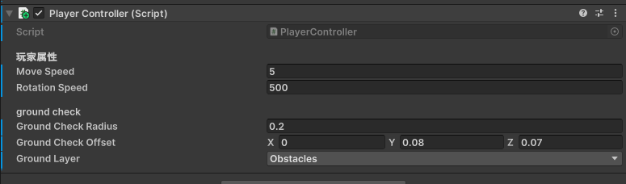

调整到球体覆盖住角色的脚

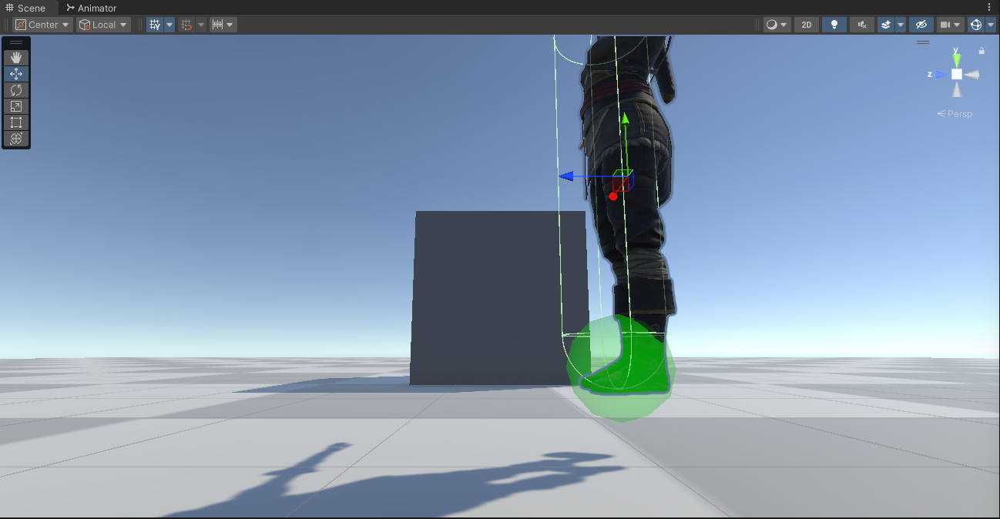

为plane和其他障碍物添加Layer为Obstacles

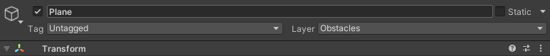

### 重力设置

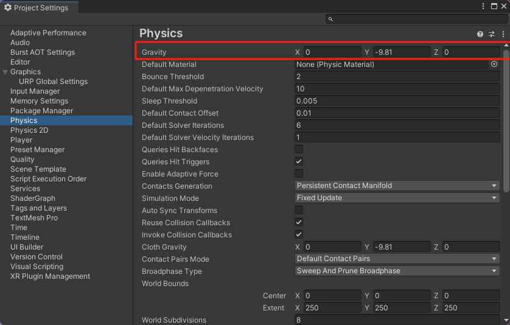

```csharp
    float ySpeed;
```

Update()

```csharp
        #region 碰撞检测
        GroundCheck();

        #endregion

        if (isGrounded)
        {
            //设置一个较小的负值，让角色在地上的时候被地面吸住
            ySpeed = -0.5f;
        }
        else
        {
            //在空中时，角色的速度由ySpeed决定
            ySpeed += Physics.gravity.y * Time.deltaTime;
        }

        var velocity = moveDir * moveSpeed;
        velocity.y = ySpeed;
        //帧同步移动
        //通过CharacterController.Move()来控制角色的移动，通过碰撞限制运动
        charactercontroller.Move(velocity * Time.deltaTime);

        //每次判断moveAmount的时候，确保只有在玩家实际移动时才会更新转向
        //没有输入就不更新转向，也就不会回到初始朝向
        if (moveAmount > 0)
        {
            //人物模型转起来：让人物朝向与移动方向一致
            targetRotation = Quaternion.LookRotation(moveDir);
        }
        //更新transform.rotation：让人物从当前朝向到目标朝向慢慢转向
        transform.rotation = Quaternion.RotateTowards(transform.rotation, targetRotation,
                         rotationSpeed * Time.deltaTime);
        #endregion


```

y轴方向的位置移动实时更新，即使没有输入也要更新。

效果如下：


下面设置skin width：

> 官方手册描述：
>
> Character Controller——**Skin width**
>
> 两个碰撞体可以穿透彼此且穿透深度最多为皮肤宽度 (Skin Width)。较大的皮肤宽度可减少抖动。较小的皮肤宽度可能导致角色卡住。合理设置是将此值设为半径的 10%。

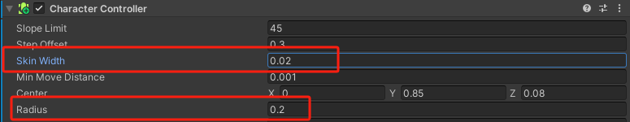

Center的更准确的设置：

**`Center.Y = Height /2 + Skin Width`**

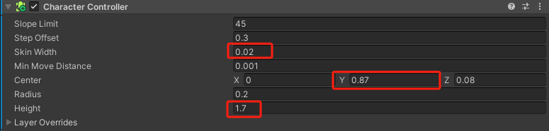

改之前：

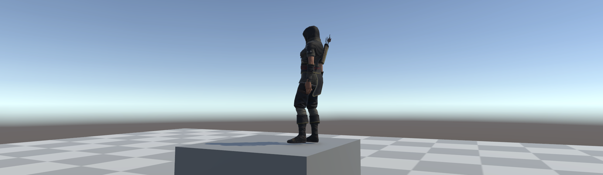

改之后：

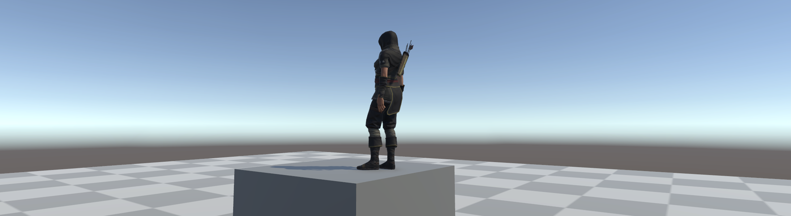

可以看到，脚部完全贴合地面，that's good.

> 有个问题仍然存在：当我们在下落过程中，角色仍在播放走路动画

因此我们需要编写相应的动画逻辑，还可以加下落动画，这个放在后面再写，**坑+1**

### 手柄适配

下面改一下对手柄的适配，因为在写摄像机输入控制的时候用的是Mouse：

在Project Settings - Input Manager里面找到Mouse X和Y，分别复制两个副本，重命名为Camera X/Y

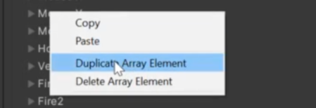

对第二个Camera进行如下设置

注意死区和灵敏度最好设置成和下面的Horizontal一样的值

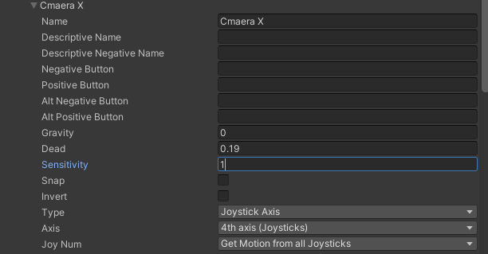

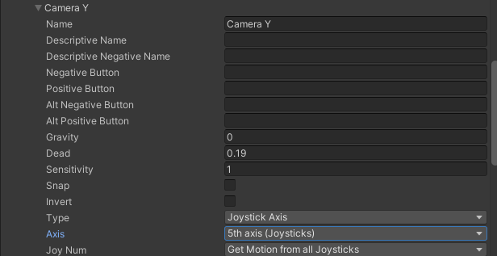

回到CameraController.cs脚本，修改如下即可

```csharp
        //水平视角控制——鼠标(手柄)x轴控制rotationY
        rotationY += Input.GetAxis("Camera X") * rotationSpeed * invertYValue;
        //垂直视角控制——鼠标(手柄)y轴控制rotationX
        rotationX += Input.GetAxis("Camera Y") * rotationSpeed * invertXValue;
```

> 有个小问题：**键鼠控制的话就勾上X轴反转，手柄控制就不要勾了**

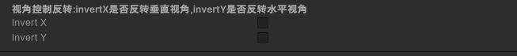

效果就是手柄右摇杆也能控制相机视角了，演示就不放了，没啥区别

ok，可以开始编写最有意思的跑酷系统脚本了！


## Day 5 跑酷系统

### 障碍检测


### 障碍高度检测


### 动作匹配
